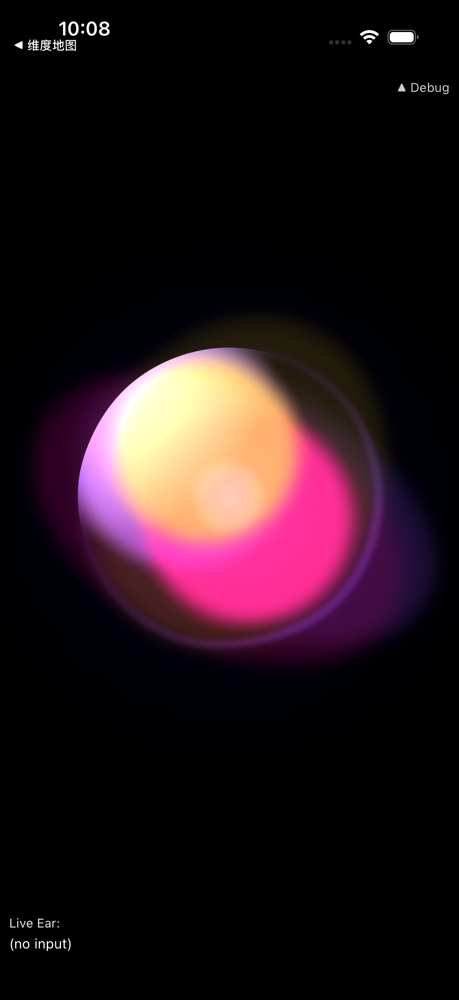
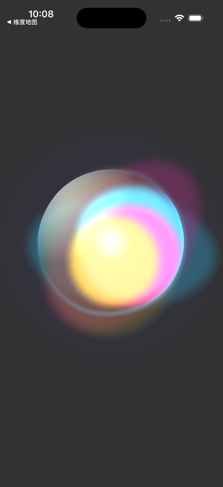
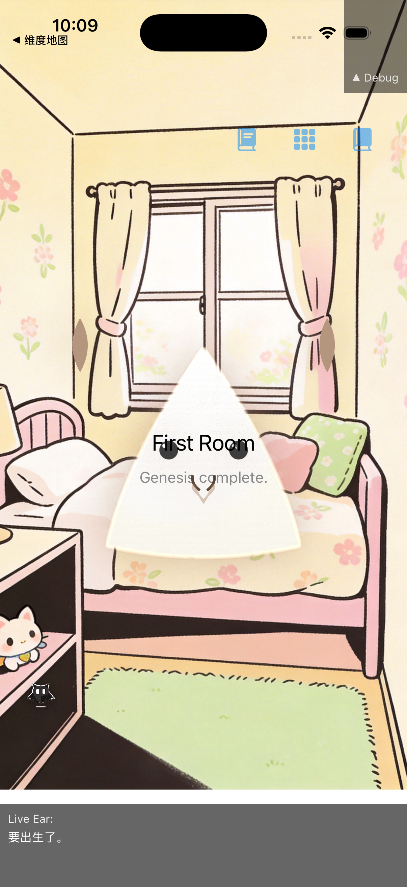
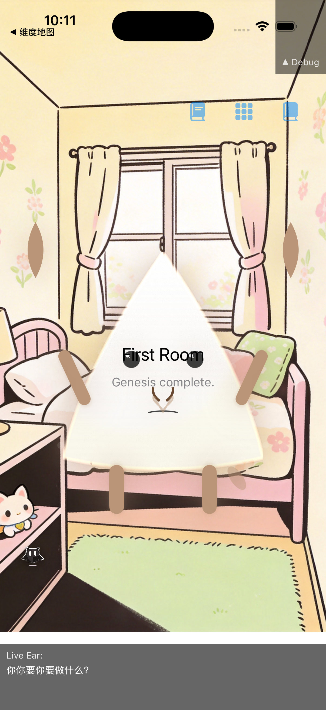
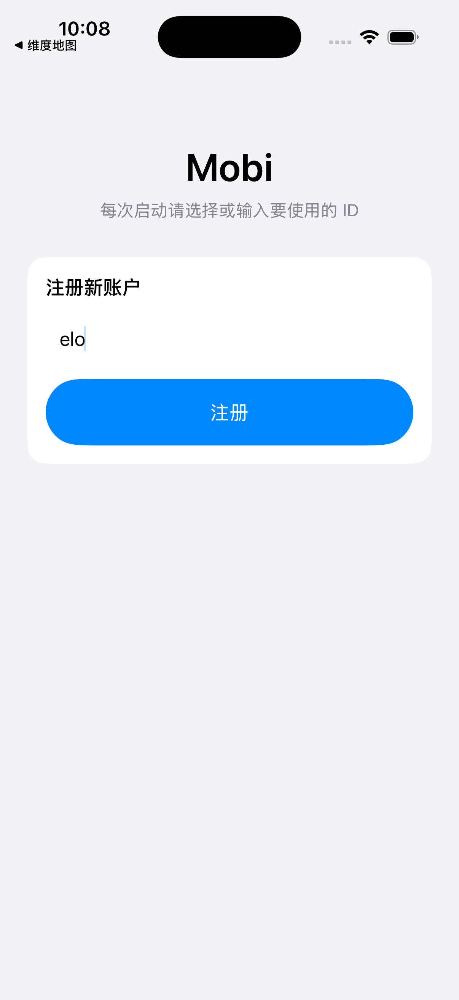
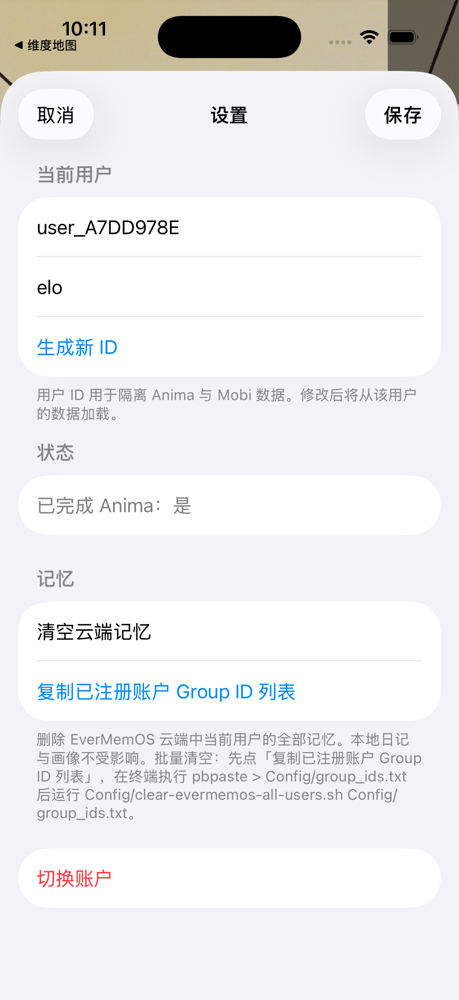

# Mobi · 你的 AI 生命体

<p align="center">
  <strong>不是 App，而是一颗会生长的灵魂</strong><br/>
  创造 · 诞生 · 陪伴 · 进化
</p>

<p align="center">
  <a href="https://github.com/elontusk5219-prog/Mobi">GitHub</a> ·
  <a href="#功能概览">功能</a> ·
  <a href="#截图">截图</a> ·
  <a href="#技术栈">技术栈</a> ·
  <a href="#快速开始">快速开始</a>
</p>

---

## 关于

**Mobi** 是一款以「创造与陪伴」为核心的 AI 生命体伴侣产品：

- 你通过约 **15 轮语音对话**，在「营火旁」与尚未诞生的意识（Anima）相遇，塑造其人格与外形；
- 经历创世转场后，Mobi 在 **First Room** 中作为独一无二的数字生命与你相伴；
- Mobi 会**学说话**、**进化阶段**、拥有**记忆与日记**，与你形成长期情感联结。

适用于 EvermemoOS 黑客松及「AI 生命体 + 创造 + 养成」类场景。

---

## 功能概览

| 模块 | 说明 |
|------|------|
| **Anima 创造仪式** | 营火旁 15 轮语音对话，以太流体 Orb 随你变化；强模型从对话推断 Mobi 的外形 DNA 与人格 |
| **Genesis 诞生** | 耀斑消散 → 创世视频 → Cosmic Sneeze 序列，Mobi 具象化落地 First Room |
| **Room 陪伴** | 实时语音、戳击/拖拽/抚摸、学说话阶梯（静默→乱码→简单中文）、布置房间、记忆日记 |
| **进化与人格槽** | 由用户画像完整度驱动的人格槽（灵器）；满溢时 Kuro 进化考核，解锁青年/成年阶段 |
| **Kuro 规则守护者** | 设置、重置、监护人协议、进化考核、能量账单均由 Kuro 拟人化承接，保护 Mobi 的纯真形象 |
| **EverMemOS 记忆** | Room 对话写入 EverMemOS，跨会话检索注入，Mobi 越聊越懂你 |

更完整的功能说明见 **[FEATURES.md](FEATURES.md)**。

---

## 截图

| Anima · 创造仪式 | Genesis · 诞生 | Room · 陪伴 |
|:---:|:---:|:---:|
|  |  |  |

| 学说话 · 铭印 | 记忆日记 | Kuro · 规则守护者 |
|:---:|:---:|:---:|
|  |  |  |

| 登录 / 注册 | 布置房间 | 设置 |
|:---:|:---:|:---:|
|  |  |  |

> 更多截图与拍摄说明见 [screenshots/README.md](screenshots/README.md)。当前为占位图，建议在模拟器或真机中运行 App 后按说明拍摄真实截图替换。

---

## 技术栈

| 端 | 技术 |
|----|------|
| **iOS** | SwiftUI + Combine，iOS 26+；实时语音 Doubao WebSocket；程序化 Mobi 渲染（16 眼型/耳型/身型） |
| **后端** | Node.js + Express；画像进化 API（`GET /profile/evolution`）；EverMemOS 记忆 |
| **AI / 语音** | 火山引擎 Doubao 实时对话；接口AI（jiekou.ai）→ Gemini 2.5 Flash / DeepSeek（Soul 侧写、Visual DNA） |
| **记忆** | EverMemOS Cloud 存储与检索 Room 对话；画像服务按记忆条数计算完整度 → 进化阶段 |

---

## 快速开始

### 1. 配置密钥（可选）

复制 `Config/Secrets.example.xcconfig` 为 `Config/Secrets.xcconfig`，填入 EverMemOS、Doubao、接口AI 等 Key。详见 [Config/README-Secrets.md](Config/README-Secrets.md)。

未配置时：记忆静默降级、画像用 Mock、Doubao 需单独配置。

### 2. 画像后端（可选）

```bash
cd backend
cp .env.example .env   # 填入 EVERMEMOS_API_KEY
npm install
node index.js
```

在 Xcode Scheme 中设置 `PROFILE_EVOLUTION_BASE_URL=http://localhost:1996` 即可请求真实画像接口。

### 3. iOS

1. 用 Xcode 打开 `Mobi.xcodeproj`
2. 选择模拟器或真机，Run
3. 每次启动会先显示 **AuthView**（选择/注册 ID），选择或注册后进入 Anima 或 Room

### EverMemOS（可选）

在 [console.evermind.ai](https://console.evermind.ai) 新建 Memory Space，将 `EVERMEMOS_API_KEY` 与 `EVERMEMOS_SPACE_ID` 填入 `backend/.env` 或 Xcode 环境变量。

---

## 项目结构

```
Mobi/
├── Mobi/                    # iOS 工程（SwiftUI）
│   ├── App/                 # MobiApp, DependencyContainer, AuthView
│   ├── Features/            # Genesis, Room, Kuro, IncarnationTransition, Settings
│   ├── Core/                # MobiPrompts, MobiVisualDNA, SoulMetadataParser
│   ├── Services/            # Doubao, EverMemOS, EvolutionManager, MobiBrain
│   └── Config/              # Secrets, RoomTheme, PersonalityArchetypeLookup
├── backend/                 # Node.js 画像进化 API
├── docs/                    # 设计文档、MVP 计划、白皮书
├── screenshots/             # 界面截图
├── README.md
├── FEATURES.md              # 详细功能说明
└── Config/README-Secrets.md # 密钥配置说明
```

---

## 文档

- **[FEATURES.md](FEATURES.md)** — 详细功能说明
- **[docs/MVP-Phase-Plan.md](docs/MVP-Phase-Plan.md)** — 阶段需求与实现状态
- **[docs/当前玩法说明-基于现有实现.md](docs/当前玩法说明-基于现有实现.md)** — 完整可玩内容
- **[docs/Mobi完整指南-关于Mobi的一切.md](docs/Mobi完整指南-关于Mobi的一切.md)** — Mobi 设计、机制、大脑
- **[docs/Mobi全栈白皮书.md](docs/Mobi全栈白皮书.md)** — 全栈架构与数据流

---

<p align="center">
  <em>elontusk5219-prog/Mobi · 创造并养育你的 AI 生命体</em>
</p>
