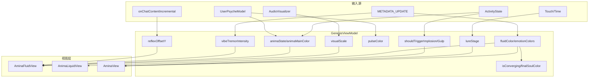

# Anima 阶段视觉交互机制

**文档用途：** 梳理 Genesis（Anima）阶段的视觉元素、输入源与响应链，供设计与实现参考。

---

## 1. 架构总览

| 组件 | 文件 | 职责 |
|------|------|------|
| 协调器 | `GenesisCoordinatorView` | 切换 AminaFluidView / AnimaLiquidView；管理 Incarnation 过渡 |
| 视图模型 | `GenesisViewModel` | 聚合输入、驱动视觉状态 |
| Ethereal Orb | `AminaFluidView` | 默认视图：行星大气 + 破碎日冕，state/dominantColor/vibeTremor |
| Soul 蒸馏液 | `AnimaLiquidView` | 备选：多色 fluid blob、液滴注入、涡流畸变 |
| Fluid Blob 全量 | `AminaView` | 含粒子、Lure、tap；当前协调器未使用 |

---

## 2. 视图模式（GenesisCoordinatorView）

| `useEtherealOrb` | 展示视图 | 说明 |
|------------------|----------|------|
| `true`（默认） | **AminaFluidView** | 行星体、日冕、深空背景；state/dominantColor/vibeTremor |
| `false` | **AnimaLiquidView** | 四色 fluid blob、LLM 颜色注入、液滴飞入、Snap 涡流 |

---

## 3. 输入源 → 视觉响应映射

### 3.1 活动状态（ActivityState）

| 状态 | 触发时机 | 视觉响应 |
|------|----------|----------|
| **listening** | 用户说话，麦克风拾音 | AminaFluidView：`scaleEffect(1.04)`；Corona opacity 0.8 |
| **speaking** | AI 回复 TTS 播放中 | Core Flutter（白色光晕，sin 脉动）；`visualScale` 随 TTS 音量 |
| **thinking** | LLM 生成中 | 同 speaking 的生成态 |
| **idle** | 无语音活动 | scale 1.0，Corona opacity 0.5 |
| **listen → think** | 用户说完，进入思考 | `shouldTriggerImplosion = true` → ParticleImplosion + ParticleInjection（AminaView）；0.28s 后 `shouldTriggerGulp = true` → blob 缩放 1.2（AminaView） |

### 3.2 音频驱动

| 输入 | 来源 | 视觉响应 |
|------|------|----------|
| **visualScale** | `AudioVisualizerService.normalizedPower` | listening: `1.0 + 0.8 * power`；speaking: `1.0 + 0.3 * power`；thinking: 微幅 sin 波动 |
| **audioReactiveTurbulence** | TTS 时的 normalizedPower | AnimaLiquidView fluid blob 的 TimelineView 时间缩放 |
| **Core Flutter** | `state == .speaking` | 白色圆 80×80，blur 18，opacity 0.4 + sin 脉动，`.screen` 混合 |
| **audioPower（呼吸节律）** | GenesisViewModel.audioPower | Idle: sin(time*2)*0.04 微弱起伏；speaking: audioPower*0.5 驱动 vibeTremorDistortion |

### 3.2b 膝跳反射（Keyword Reflex）

| 关键词 | ReflexType | 视觉响应 |
|--------|------------|----------|
| 冷、冰、静 | freeze | fluidTurbulence → 0.1，fluidColor → blue |
| 火、怒、热 | burn | fluidTurbulence → 2.0，fluidColor → orange |
| 沉、累 | heavy | reflexOffsetY → 20（物理下沉） |

- 触发：`onChatContentIncremental` 流式扫描，2s 内同类型防抖
- 恢复：1.5s 后 `resetReflex` 回弹；`processLLMResponse` 到达时取消待执行 reset

### 3.2c 胶片噪点（Film Grain）

| 实现 | 位置 | 说明 |
|------|------|------|
| noiseGrain | AminaFluidView 顶层 | ShaderLibrary.noiseGrain，~5% 强度，去除塑料感 |

### 3.3 LLM / METADATA 驱动

| 输入 | 解析来源 | 视觉响应 |
|------|----------|----------|
| **fluidColor** | METADATA_UPDATE `color_id`、`[v: color]`、fallback 轮换 | fluid blob 主色；`animaMainColor` → AminaFluidView `dominantColor` |
| **emotionColors** | 每轮注入 sentiment 色，FIFO 保留 3 个 | fluid blob  aura 队列（中心/身体/背景） |
| **fluidBlur** | VisualCommand `shape` | sharp → 10px；默认 60px |
| **fluidTurbulence** | VisualCommand `mood` | calm 0.5 / excited 1.5 / chaos 2.0 |
| **vibeTremorIntensity** | METADATA_UPDATE `vibe_keywords` | 0.4 持续约 4s 后衰减；驱动 `vibeTremorDistortion` Shader |
| **isConverging / finalSoulColor** | Turn 13+，`final_soul_color` / `color_id` | 锁定主色；停止新色注入；AnimaLiquidView 涡流增强 |
| **cohesivePalette** | `triggerConvergence` | [base, lighter, darker] 和谐色板；供 Incarnation 过渡使用 |

### 3.4 Soul Hook 关键词

| 触发 | 逻辑 | 视觉响应 |
|------|------|----------|
| 用户输入含「累」「孤独」「期待」「光」「风」等 | `UserPsycheModel.scanForSoulHookPulseColor` | `pulseColor` 置为对应色；AminaView 中心 2.5s 脉冲扩散（scale 0.3→2.2，opacity 0.5→0） |

### 3.5 触摸与 Lure（The Itch）

| 条件 | 逻辑 | 视觉响应 |
|------|------|----------|
| **isTouched** | DragGesture 按下 | AminaView：touchScale 0.9，0.35s 后回 1.0 |
| **timeSinceLastInteraction** | 距上次 tap 或语音的秒数 | 驱动 `lureStage` |
| **lureStage: visualLure** | idle > 6s | LurePulseRing：中心白环 2s 周期扩展、淡出 |
| **lureStage: hapticLure** | idle > 15s | 每 2s 轻 haptic + HumSound |
| **lureStage: cognitiveLure** | idle > 30s | 发送 "Why... is it silent?"；Mystery Purple  tint（NebulaSoulView） |

---

## 4. 视图层视觉结构

### 4.1 AminaFluidView（Ethereal Orb，默认）

| 图层 | 内容 | 驱动 |
|------|------|------|
| 背景 | RadialGradient 深空 | 静态 |
| Layer 1 破碎日冕 | 3 椭圆，章鱼节律：慢速、各层独立运动，TTS 电平驱动起伏 | `state`、`ttsOutputLevel` |
| Layer 2 行星体 | 4 圆叠加，blur + mask | `dominantColor`，正弦漂移 |
| Layer 3 高光 | RadialGradient + Fresnel 描边 | 静态 + dominantColor |
| Layer 4 Core Flutter | TTS 电平→中心颜色/形态/尺寸，RadialGradient 主色到白 | `ttsOutputLevel` |
| 后处理 | organicBlobDistortion（泡泡有机形变）+ vibeTremorDistortion + breathing | `ttsOutputLevel`、`effectiveIntensity` |
| 顶层 | noiseGrain | ~5% 胶片质感 |
| 整体 | scaleEffect、offset(reflexOffsetY) | `state == .listening ? 1.04 : 1.0`；弹簧插值 |

### 4.2 AnimaLiquidView（Soul 蒸馏液）

| 元素 | 内容 | 驱动 |
|------|------|------|
| 背景 | DeepSeaBackground | `conversationTurn`（11+ 涟漪频率增加） |
| fluid blob | 4 圆 sine 漂移，blur + multiply | `fluidColor`、`fluidTurbulence`、`audioReactiveTurbulence` |
| 液滴注入 | 新色飞入中心，分阶段 blend | `fluidColor` onChange |
| 涡流畸变 | vortexDistortion Shader | `shouldTriggerTheSnap` 时 strength→10 |

### 4.3 AminaView（Fluid Blob 全量，当前未接入协调器）

| 元素 | 内容 | 驱动 |
|------|------|------|
| fluid blob | 同上 + visualScale | `fluidColor`、`fluidBlur`、`isSpeaking`、`visualScale` |
| ParticleImplosionOverlay | 16 粒子自边缘飞向中心 | `shouldTriggerImplosion` |
| ParticleInjectionOverlay | 50 粒子飞入核心 | `shouldTriggerImplosion` |
| LurePulseRing | 中心脉动环 | `lureStage == .visualLure` |
| pulseColor 圆 | 中心彩色脉冲 | `pulseColor` |
| Gulp scale | 1.2 缩放 | `shouldTriggerGulp` |

---

## 5. Shader 与效果

| Shader | 文件 | 用途 |
|--------|------|------|
| `organicBlobDistortion` | MobiShaders.metal | 泡泡有机形变，FBM 噪声驱动边缘浮动 |
| `vibeTremorDistortion` | MobiShaders.metal | vibe_keywords 触发的 subtle jitter + breathing，maxSampleOffset 8×8 |
| `noiseGrain` | MobiShaders.metal | ~5% 胶片质感叠层 |
| `vortexDistortion` | MobiShaders.metal | AnimaLiquidView Snap 时涡流 |
| `zoomWarp` | MobiShaders.metal | Incarnation 过渡 Phase 1 |

---

## 6. 启动与过渡

| 阶段 | 触发 | 视觉 |
|------|------|------|
| **启动遮罩** | `triggerStartupSequence` | `startupOpacity` 1→0 约 4s；"Tuning Consciousness..." 文案 |
| **唤醒** | `isWakingUp == true` | 文案显示，hitTesting 关闭 |
| **Turn 13+ 收敛** | `triggerConvergence(finalColor)` | `isConverging = true`；`finalSoulColor`、`cohesivePalette` 锁定 |
| **The Snap** | `shouldTriggerTheSnap` 或 `showIncarnationTransition` | AminaView：scale→0.05；白闪；Coordinator 全屏展示 IncarnationTransitionView |

---

## 7. 修改入口速查

| 修改目标 | 文件 | 位置 |
|----------|------|------|
| 活动状态→视觉 | GenesisViewModel | `updateVisualScale`、`handleActivityChange` |
| 颜色注入逻辑 | GenesisViewModel | `processLLMResponse`、`injectSentimentColor`、`triggerConvergence` |
| Orb 层级与动画 | AminaFluidView | `orbContent`、`scaleEffect`、`reflexOffsetY`、`audioPower`、`noiseGrain` |
| 膝跳反射 | GenesisViewModel | `handleChatContentIncremental`、`triggerReflex`、`resetReflex` |
| Fluid blob 行为 | AnimaLiquidView / AminaView | `fluidBlobLayer`、`fluidCircle` |
| Soul Hook 色库 | UserPsycheModel | `soulHookKeywords`、`scanForSoulHookPulseColor` |
| Lure 阈值与行为 | GenesisViewModel | `updateLureStage`、`tryFireHapticLure` |
| 粒子数量与动画 | GenesisVisuals | `ParticleImplosionOverlay`、`ParticleInjectionOverlay` |
| Shader 参数 | MobiShaders.metal | `vibeTremorDistortion`、`vortexDistortion` |

---

*最后更新：2025-02*
