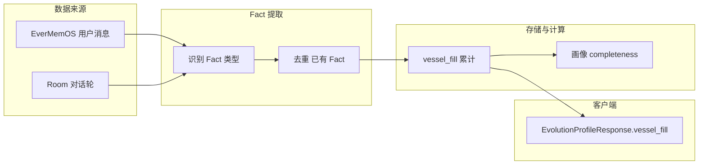

# Fact 粒度注入设计（Soul Vessel 可选扩展）

**用途：** 定义「有效用户 Fact」的类型、提取方式、与画像服务/EverMemOS 的对接，以及如何驱动 Soul Vessel 的增量填充。为**可选扩展**：MVP 用 slotProgress/completeness 驱动 Vessel；本设计供后续画像服务实现 Fact 感知的 vessel_fill 时参考。

**维护：** 与 [SoulVessel设计规范](SoulVessel设计规范.md)、[画像服务设计](画像服务设计.md)、[画像-进化接口契约](画像-进化接口契约.md) 同步。

---

## 1. Fact 类型与填充量

| Fact 类型 | 说明 | 示例 | Vessel 填充增量 | 视觉反馈 |
|-----------|------|------|-----------------|----------|
| **闲聊** | 无有效人格/偏好/经历信息 | "今天天气不错"、"嗯"、"好的" | +0% | 无变化 |
| **偏好** | 明确陈述喜好、习惯、口味等 | "我不吃香菜"、"我喜欢熬夜" | +2% | 一颗小光点飞入 |
| **深度暴露** | 涉及经历、情绪、自我认知的深度表达 | "其实我很怕孤独，因为小时候..." | +10% | 大光团飞入，瓶身发光震动 |
| **纠正认知** | 纠正 AI 或之前的错误认知 | "不，我是设计师不是程序员" | +5% | 液体颜色微调 (Shift) |

---

## 2. 数据流

- **输入**：EverMemOS 中的用户消息（Room 对话 user role）；或 Room 每轮结束时上报的 user 文本。
- **提取**：画像服务（或独立 Fact 模块）对每条用户消息做 Fact 识别（规则或 LLM），判定类型（闲聊/偏好/深度暴露/纠正认知）。
- **去重**：同一 Fact 语义不重复计（如「我不吃香菜」出现多次只计一次）。
- **累计**：`vessel_fill += delta`，delta 按上表；上限 1.0。
- **输出**：画像 API 的 `vessel_fill` 字段；客户端优先用 API 返回值，未提供时用 slotProgress 推导。

---

## 3. 与画像完整度的关系

- **可选 A（独立）**：vessel_fill 与 completeness 分别计算；Fact 注入仅更新 vessel_fill；completeness 仍由维度置信度聚合。二者可略有差异，Vessel 更偏「懂你的程度」，completeness 更偏人格画像。
- **可选 B（统一）**：vessel_fill = f(completeness, fact_count)，例如 `vessel_fill = completeness * (1 + 0.1 * min(fact_count, 5))`，Fact 多时略上浮。实现简单，与现有 completeness 兼容。
- **推荐**：MVP 后若做 Fact 粒度，先用**独立 vessel_fill**，便于单独调优填充体验；进化阶段仍以 completeness 阈值为准（或 vessel_fill 与 completeness 取 max 参与阶段判定，由产品定）。

---

## 4. 提取方式建议

- **规则**：关键词、句式模板（如「我喜欢…」「其实我…」「不，我是…」）做初筛；准确率有限，易误判。
- **LLM**：每条用户消息调用轻量模型做分类（闲聊/偏好/深度暴露/纠正/无法分类）；可结合画像服务已有的对话分析管线。成本较高，准确率更好。
- **混合**：规则粗筛 + LLM 精判；或仅对「疑似非闲聊」的消息做 LLM，降低成本。

---

## 5. 与 EverMemOS / 画像服务的对接

- **消费时机**：画像服务在消费 EverMemOS memories 时，对每条 `sender == user` 的 content 做 Fact 提取；或订阅 Room 对话写入事件，实时处理。
- **存储**：可扩展 EverMemOS 或画像侧存储「用户 Fact 列表」；每条含 type、content_hash（去重用）、timestamp。vessel_fill 由 Fact 列表累计计算，或单独维护 vessel_fill 字段按增量更新。
- **API**：画像 GET `/profile/evolution` 响应中增加 `vessel_fill`（0–1）；客户端收到则用，未收到则用 slotProgress。无需新端点。

---

## 6. 客户端对接

- 已支持：画像 API 的 `vessel_fill` 为可选字段；[EvolutionManager](Mobi/Services/Data/EvolutionManager.swift) 或 EvolutionProfileResponse 若解析到 `vessel_fill`，可传给 Soul Vessel 视图作为填充度；未提供时用 `slotProgress`（见 [SoulVessel设计规范](SoulVessel设计规范.md) §5）。
- 视觉反馈：当 `vessel_fill` 较上次增加且增量对应「偏好」或「深度暴露」时，触发光点飞入/液面激荡；可由客户端对比前后 vessel_fill 或由 API 返回 `vessel_fill_delta`（可选）驱动。MVP 下 slotProgress 增加时已有 vesselAgitated 逻辑，Fact 粒度接入后沿用即可。

---

## 7. 实现优先级

- **P0**：无需实现；MVP 用 slotProgress 驱动 Vessel 已满足。
- **P1**：画像服务在现有 completeness 之外增加 vessel_fill 字段，初版用 `vessel_fill = completeness`，与现有逻辑一致。
- **P2**：接入 Fact 提取（规则或 LLM），按 Fact 类型累计 vessel_fill；去重、存储、API 扩展按本文实现。

---

## 8. 相关文档

| 文档 | 路径 |
|------|------|
| Soul Vessel 设计规范 | docs/SoulVessel设计规范.md |
| Soul Vessel 施工顺序表 | docs/SoulVessel施工顺序表.md |
| 画像服务设计 | docs/画像服务设计.md |
| 画像-进化接口契约 | docs/画像-进化接口契约.md |
