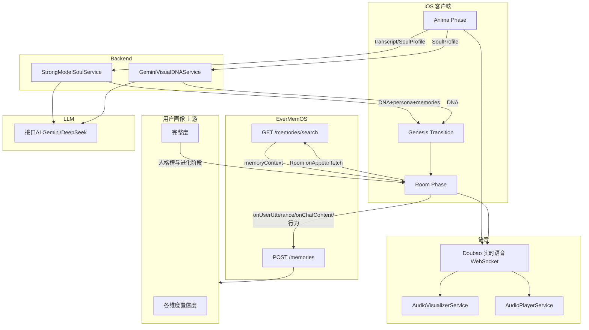

# Mobi 全栈白皮书

**文档用途：** 全栈架构与数据流权威参考。覆盖 iOS 客户端、Backend API、关键链路与技术栈。与 [MVP-Phase-Plan.md](MVP-Phase-Plan.md)、[Mobi完整指南-关于Mobi的一切.md](Mobi完整指南-关于Mobi的一切.md) 共同构成项目核心文档。

**维护：** 每次架构变更、新模块、新 API 需同步更新本文档。工作流见 `.cursor/rules/mvp-plan-workflow.mdc`。

---

## 1. 全栈总览

### 1.1 架构图



### 1.2 技术栈

| 层级 | 技术 |
|------|------|
| **iOS** | SwiftUI, Combine, AVFoundation, CoreMotion |
| **语音** | 火山引擎 Doubao 实时对话 WebSocket |
| **Backend** | 接口AI (jiekou.ai) → Gemini 2.5 Flash / DeepSeek |
| **存储** | UserDefaults (EvolutionManager, birthMemories)；EverMemOS Cloud (Room 跨会话记忆) |
| **资产** | SwiftUI Shape/Path；genesis_transition.mp4；角色图/视频由独立项目「Mobi资产生成」管线产出，[Mobi资产生成系统规格](Mobi资产生成系统规格.md) |

---

## 2. 客户端分层

### 2.1 Phase 结构

| Phase | 视图 | ViewModel/逻辑 | 入口 |
|-------|------|----------------|------|
| **门控** | AuthView | UserIdentityService | **每次冷启动** showAuthGate=true → 选择/注册 ID 后进入 |
| **Phase I Anima** | AminaFluidView, GenesisCoordinatorView | GenesisViewModel | MobiApp → GenesisCoordinatorView |
| **Phase II Genesis** | IncarnationTransitionView, IncarnationSequenceView | IncarnationViewModel | showIncarnationTransition |
| **Phase III Room** | RoomContainerView, ProceduralMobiView | MobiEngine, EvolutionManager | onComplete → showRoom |

### 2.2 核心服务（单例/共享）

| 服务 | 职责 |
|------|------|
| MobiEngine | lifeStage, activityState, resolvedVisualDNA, roomPersonaPrompt |
| EvolutionManager | interactionCount, intimacyLevel；**人格槽与进化解锁目标由画像完整度驱动**（见 [Mobi用户画像与进化驱动设计](Mobi用户画像与进化驱动设计.md)）；与画像 API 的请求/响应约定见 [画像-进化接口契约](画像-进化接口契约.md) |
| DoubaoRealtimeService | WebSocket 连接、上行音频、下行 TTS/ASR/550 |
| EverMemOSMemoryService | Room 对话存储、检索、记忆注入 roomSystemPrompt |
| AudioVisualizerService | 麦克风采集、16k PCM 上行、normalizedPower |
| AudioPlayerService | TTS 流播放、outputLevel |
| ParallaxMotionService | CoreMotion 视差 |
| AmbientSoundService | GenesisAmbient、Mood DSP |

### 2.2.1 账号隔离（多账号数据不串）

所有与「当前用户」相关的存储与请求均以 `UserIdentityService.currentUserId` 区分。**每次冷启动**均先显示 AuthView 选择/注册 ID，不沿用上次用户；选择或注册后清空引擎内用户专属状态并加载该 ID 数据，避免不同 Mobi 串号。

| 模块 | 隔离方式 |
|------|----------|
| **EverMemOS 记忆** | 存/搜使用 `user_id`、`group_id`（= mobi_user_\{userId\}），云端按 user 隔离 |
| **行为上报** | 同上，message_id 与 group_id 含 currentUserId |
| **画像 API** | 请求携带 `?userId=` 与 `X-User-Id`，后端按 userId 查 MemOS 并返回该用户进化/人格槽 |
| **EvolutionManager** | UserDefaults key 含 userId（userEvolutionState、evolutionProfileCache、vesselHasOverflowed） |
| **MemoryDiaryService** | birthMemories key 含 userId；日记拉取用 EverMemOSMemoryService.currentUserId |
| **MobiEngine** | 切换账号时调用 `clearUserSpecificState()` 清空 resolvedMobiConfig / resolvedVisualDNA / roomPersonaPrompt；Room onAppear 若为 nil 用 fallback |
| **Anima 完成标记** | UserDefaults key `Mobi.hasCompletedAnima.{userId}` |
| **Doubao 会话** | StartSession 的 `user_id` 使用 currentUserId（空时回退 mobi_tester） |

实现要点：登录/注册后依次调用 `EvolutionManager.reloadForCurrentUser()`、`MobiEngine.shared.clearUserSpecificState()`。

### 2.3 数据流（人格 → 外形）

```
METADATA_UPDATE → SoulMetadataParser → UserPsycheModel.profileDraft
    → buildSoulProfile() → SoulProfile
transcriptEntries → buildTranscriptJSON()

GenesisCommitAPI.commit(transcript?, profile)
    ├─ transcript 非空 → StrongModelSoulService → visual_dna, persona, memories
    └─ transcript 空   → GeminiVisualDNAService → MobiVisualDNA

resolvedVisualDNA → MobiEngine → RoomContainerView → ProceduralMobiView
    → MobiEyeView(eyeShape) + MobiEarOverlayView(earType) + MobiBodyFormShape(bodyForm)
```

---

## 3. Backend 与 API

### 3.1 GenesisCommitAPI

| 条件 | 调用 | 输入 | 输出 |
|------|------|------|------|
| transcript 非空 | StrongModelSoulService | transcript JSON | visual_dna, persona, memories |
| transcript 空 | GeminiVisualDNAService | SoulProfile.toJSONSummary() | MobiVisualDNA |

### 3.2 StrongModelSoulService

- **端点**：接口AI OpenAI 兼容 (jiekou.ai)
- **模型**：Secrets.JIEKOU_AI_SOUL_MODEL (Gemini 2.5 Flash 等)
- **输入**：15 轮 transcript `[{"role","content"}]`
- **输出**：`{ visual_dna, persona, memories }`
- **visual_dna 字段**：eye_shape(16), ear_type(16), body_form(16), material_id, palette_id, body_color_hex, movement_response, bounciness, softness, 等

### 3.3 GeminiVisualDNAService

- **端点**：同上
- **输入**：SoulProfile JSON (warmth, energy, chaos, draftShellType, draftPersonalityBase, 等)
- **输出**：MobiVisualDNA（同上字段）

### 3.4 时序

- 第 13 轮结束提前 commit，第 14、15 轮 Anima 告别时已有缓冲
- 20s 超时 Fallback：使用 MobiVisualDNA.default + draftColorId

### 3.5 画像与进化 API（契约）

- **契约文档**：[画像-进化接口契约](画像-进化接口契约.md)
- **职责**：客户端 Room 阶段拉取当前用户的进化阶段（lifeStage）、人格槽进度（slotProgress）、可选置信度衰减（confidenceDecay）与解锁项（unlockedFeatures）；EvolutionManager 与人格槽 UI 按契约消费；只进不退由服务端保证，客户端可做本地缓存与降级。
- **实现**：画像服务设计见 [画像服务设计](画像服务设计.md)（维度、完整度、只进不退、置信度衰减、伪代码）；后端按该设计实现 GET 接口并满足 [画像-进化接口契约](画像-进化接口契约.md)。进化模块（序号 2）已对接，Mock/只进不退/降级见 [Mobi进化机制实现说明](Mobi进化机制实现说明.md)。

---

## 4. 语音链路

### 4.1 Doubao 实时对话

| 环节 | 实现 |
|------|------|
| 连接 | wss://openspeech.bytedance.com/api/v3/realtime/dialogue |
| 认证 | X-Api-App-Id, X-Api-Access-Key 等 |
| StartSession | dialogue_config.system_prompt, temperature 0.9 |
| 上行 | type 200, PCM s16le 16kHz |
| 下行 | event 50/150 (session), 451 (ASR), 550 (Chat), TTS 音频 |
| ActivityState | 150→listening, TTS→speaking, 播放排空+0.9s→listening, 52000042→idle |

### 4.2 Persona 注入

- **Anima**：aminaSystemPrompt
- **Room**：roomSystemPrompt(personaJSON, memoryContext) + Trojan Horse 伪用户消息
- prepareForRoom(personaJSON:, memoryContext:) 在 Room onAppear 前调用；memoryContext 来自 EverMemOS 检索

---

## 5. 存储与持久化

| Key | 内容 | 服务 |
|-----|------|------|
| UserEvolutionState.storageKey | interactionCount, intimacyLevel, unlockedFeatures, keywordMentions | EvolutionManager |
| birthMemoriesKey | 强模型 memories（按遗忘设定不注入 prompt）| MemoryDiaryService |
| EverMemOS Cloud | Room 对话 episodic_memory（跨会话）；Anima+Room 行为可一并写入 | EverMemOSMemoryService → EverMemOSClient |

**用户画像**：以 EverMemOS 为数据底座的**上游画像服务**消费对话与行为，输出各维度估计与置信度；完整度驱动人格槽与进化阶段（幼年→青年→成年），只进不退。详见 [Mobi用户画像与进化驱动设计](Mobi用户画像与进化驱动设计.md)。

---

## 6. 白皮书与 MVP/Mobi完整指南 的关系

| 文档 | 侧重 |
|------|------|
| **Mobi全栈白皮书** | 架构、数据流、API、技术栈 |
| **MVP-Phase-Plan** | 阶段需求、状态、实现位置、Backend 简述 |
| **Mobi完整指南** | Mobi 设计、机制、大脑、自我意识、待办 |

三者互为补充：开发时**三者必读**；架构变更更白皮书，需求实现更 MVP，Mobi 行为设计更完整指南。

---

## 7. 关键设计约束

### 7.1 Anima 遗忘设定

**Mobi 出生时不会有 Anima 阶段的记忆。** 详见 [Mobi完整指南](Mobi完整指南-关于Mobi的一切.md#3-mobi-的诞生anima-遗忘设定)。

- birthMemories 来自 transcript，不应以「Mobi 记得 Anima 对话」形式注入 Room prompt
- persona 仅含性格描述，不含对话内容引用

### 7.2 Mobi 成长阶段智能差异（幼年 / 青年 / 成年）

> 详见 [Mobi交互行为完整设计](Mobi交互行为完整设计.md)、[Mobi用户画像与进化驱动设计](Mobi用户画像与进化驱动设计.md)。

进化由**用户画像完整度**驱动；人格槽 = 画像呈现；只进不退；置信度衰减时行为有感知。

| 成长阶段 | 智能特征 | 话术风格 |
|----------|----------|----------|
| 幼年期 (newborn) | 本能反应，无跨会话记忆；人格槽由画像驱动填充 | 铭印数 < 3 时乱码语学说话（ba、bo、nyeh 等），≥ 3 简单中文 |
| 青年期 (child) | 画像完整度达阈值 A；人格槽由画像驱动，EverMemOS 引用；置信度衰减时更谨慎，阶段不退 | 小孩话（短句、好奇、呀/呢/哇） |
| 成年期 (adult) | 画像完整度达阈值 B；跨会话记忆，身份叙事，主动关怀；只进不退 | 正常伙伴语气 |

---

## 8. 待补充（白皮书缺口）

| 序号 | 项 | 说明 |
|------|-----|------|
| 1 | Secrets 与配置 | API Key、AppId 等来源与安全 |
| 2 | 错误处理与重试 | API 失败、网络异常策略 |
| 3 | 端到端测试 | 关键路径验证 |
| 4 | 部署与 CI/CD | 如有 |
| 5 | 依赖版本 | Swift、Xcode、三方库 |

---

**施工进度：** Room 阶段待办以 [MVP-Phase-Plan](MVP-Phase-Plan.md) §7 与 [Mobi用户画像与进化驱动设计](Mobi用户画像与进化驱动设计.md) §9 为总表。

## 9. 相关文档

| 文档 | 路径 |
|------|------|
| MVP Phase Plan | docs/MVP-Phase-Plan.md |
| Mobi 完整指南 | docs/Mobi完整指南-关于Mobi的一切.md |
| **Mobi 进化机制实现说明** | docs/Mobi进化机制实现说明.md |
| **Mobi 用户画像与进化驱动设计** | docs/Mobi用户画像与进化驱动设计.md |
| **Mobi 交互行为完整设计** | docs/Mobi交互行为完整设计.md |
| **Mobi 行为模块实现说明** | docs/Mobi行为模块实现说明.md |
| Mobi 阶段大脑设计 | docs/Mobi阶段大脑与意识驱动设计.md |
| Mobi 记忆-大脑-行为关系 | docs/Mobi记忆-大脑-行为关系.md |
| Phase III 资产与人格映射表 | docs/PhaseIII-资产与人格映射表.md |
| 人格到外形链路审计 | docs/PhaseIII-人格到Mobi外形链路审计.md |

---

*文档版本：2025-02，初版。*
