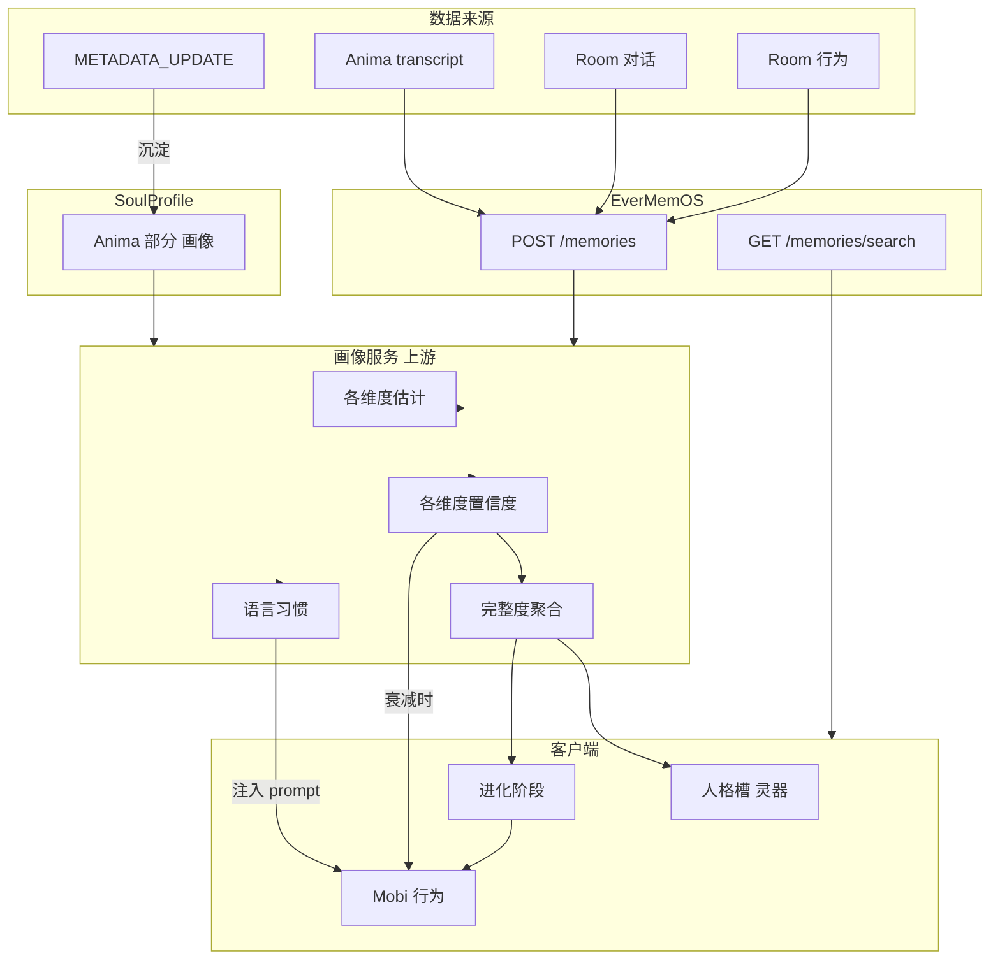

# Mobi 用户画像与进化驱动设计

**文档用途：** 定义以 EverMemOS 为技术核心的**用户人格画像**上游架构，以及画像完整度如何驱动**人格槽**与**进化阶段**（幼年→青年→成年）。进化只进不退；画像置信度衰减时 Mobi 在行为上有感知、阶段不退化。

**维护：** 2025-02 创建，与 [MVP-Phase-Plan](MVP-Phase-Plan.md)、[Mobi交互行为完整设计](Mobi交互行为完整设计.md)、[Mobi记忆-大脑-行为关系](Mobi记忆-大脑-行为关系.md) 同步。

---

## 1. 设计目标

| 目标 | 说明 |
|------|------|
| **进化由「懂用户」驱动** | 幼年→青年、青年→成年的节点由**用户人格画像的完整程度**决定，而非轮数或时间 |
| **人格槽 = 画像的呈现（灵器）** | 人格槽即灵器；灵器瓶身填充由画像完整度（各维度置信度）驱动，与进化共用同一数据源 |
| **三阶段同步** | 仅一套真实阶段（幼年/青年/成年），无独立剧本时间线；行为、玩法、叙事与当前阶段一致 |
| **只进不退** | 进化阶段不因置信度下降而回退；置信度衰减时 Mobi 在行为上「意识到」并反映，但阶段保持 |

---

## 2. 用户人格画像：数据范围与建设主体

### 2.1 数据范围

- **Anima + Room 全程**：对话文本与行为均在后台沉淀，参与画像构建。
- **语言**：Anima 的 transcript、Room 的 onUserUtterance / onChatContent（含 ASR 转写与 LLM 回复）。
- **行为**：Room 内的戳击、长按抚摸、拖拽、沉默时长、谁先开口、触摸频率等（由客户端上报或由会话事件推断）。
- **用户倾诉的现实生活**：用户常向 Mobi 倾诉自己在现实中的经历与处境——如「今天被老板骂了」「刚分手」「考试过了」「工作好累」「和家里人吵架了」等。这类内容：
  - 随对话存入 EverMemOS，作为**记忆层**供 Mobi 在后续对话中引用（memoryContext、「你上次说过……」）；
  - 参与画像：可提取**关键生活事件、当前处境、压力源与喜悦**等，形成「生活上下文」层，既丰富人格推断的语境（如常倾诉压力→情绪稳定性相关信号），也可供 persona / sendTextInstruction 注入，使 Mobi 的回应更贴合用户当下状态；
  - 与世界观衔接：用户说「现实好累」时，Mobi 可回应「就像我去荆棘谷采集一样」——画像中的生活倾诉为这类隐喻与共情提供素材。

### 2.2 建设主体：以 EverMemOS 为技术核心的上游架构

- **技术核心**：EverMemOS 负责存储与检索（如现有 POST /memories、GET /memories/search）；其**上游**增加一层「用户画像服务」，对写入的记忆与行为进行聚合与推断，输出**各维度估计值 + 置信度**。
- **建设主体**：该画像服务可在后端实现；若与现有某后端服务（如 StrongModelSoulService 的输入输出、或单独的用户分析服务）契合度高，可合并到同一服务内，不必强行独立部署。
- **数据流**：Anima 与 Room 的对话与行为事件 → EverMemOS 存储 → 画像服务消费（或订阅）→ 更新各维度估计与置信度 → 输出给客户端（人格槽数值、进化阶段判定）。

### 2.3 SoulProfile 与 METADATA：画像的 Anima 部分

**SoulProfile 是用户画像的一部分**，专门承接 Anima 阶段的结构化数据；METADATA 沉淀为 SoulProfile。

| 概念 | 说明 |
|------|------|
| **METADATA** | Anima 每轮 Shadow Analysis 的 METADATA_UPDATE 输出（shell_type, personality_base, energy_tag, intimacy_tag, current_mood, openness, communication_style, color_id, thought_process 等）|
| **沉淀** | METADATA 在 Anima 中逐轮累积，**沉淀 / 写入**为 SoulProfile；SoulProfile 是 METADATA 的结构化载体 |
| **SoulProfile** | 用户画像的 **Anima 部分**；对应现有 `UserPsycheModel.buildSoulProfile()` 产出的结构（warmth, energy, chaos + draft 字段）|
| **用户画像** | SoulProfile（Anima 部分）+ Room 对话与行为持续更新后的各维度；画像服务统一管理与置信度计算 |

**数据流：**

```
Anima 每轮 METADATA_UPDATE → 沉淀 → SoulProfile（作为用户画像的 Anima 部分）
用户画像 = SoulProfile + Room 对话与行为 → 各维度估计与置信度 → 人格槽与进化
```

**实现含义：** SoulProfile 不再只是「提交给 Gemini 的一次性快照」，而是**用户画像在 Anima 阶段的结构化表示**；画像服务可将 SoulProfile 作为 Anima 侧的种子数据，与 Room 数据一起参与各维度估计与完整度聚合。

---

## 3. 画像维度与置信度

**用户画像更偏重于用户的人格。** 维度设计以心理学人格建模为参照，便于从对话与行为中推断、并可与 SoulProfile / METADATA 对齐。

### 3.0 人格心理学依据

人格心理学中常用**特质论**与**维度化**建模：人格由若干连续维度描述，每人落在各维度的某一点，而非离散类型。以下为常见框架，可作为画像维度的科学参照。

| 框架 | 维度 | 说明 |
|------|------|------|
| **Big Five（五因素模型 OCEAN）** | Openness 开放性、Conscientiousness 尽责性、Extraversion 外向性、Agreeableness 宜人性、Neuroticism 神经质 | 心理学中最常被验证的人格模型；从语言与自我描述中可因子分析得出；从**对话与文本**中做自动人格推断的研究多基于此 |
| **HEXACO** | 在五因素基础上增加 Honesty-Humility 诚实-谦逊；其余为 Emotionality、eXtraversion、Agreeableness、Conscientiousness、Openness | 六维模型，跨语言词汇研究支持；若产品需「可信/谦逊」等人际道德维度可考虑 |
| **计算人格评估（CPA）** | 从数字足迹推断特质 | 利用对话、社交文本、行为等数字数据，通过机器学习推断人格；各特质可拆为更细的 facet（子维度）以提高可推断性 |

**与 Mobi 的衔接：**

- **从对话推断人格**：研究显示，话语中的用词、句长、情感倾向、话题等**语言线索**可用于 Big Five 等特质的自动识别；Anima/Room 的 transcript 与 METADATA 正是此类输入。
- **从行为推断**：戳击频率、长按、沉默、谁先开口等**行为**可参与推断（如外向性、宜人性、情绪稳定性）；与「语言+行为一起算」一致。
- **维度选择**：画像服务可采用 Big Five 五维、或与 SoulProfile/METADATA 字段对齐的简化/融合维度集（见下）；实现时可在科学可解释性与产品需求之间权衡。

### 3.1 各维度为标量，以置信度为核心

- **每个维度**：一个标量估计值（如 0–1 或离散档位）+ **该维度的置信度**（0–1）。
- **完整度**：由**各维度置信度**决定；不采用单一「总分」开关，而是「有多少维度达到可用的置信度」或「各维度置信度的聚合」（如平均、加权和、或满足阈值的维度数）。
- **人格导向的维度示例**（以 Big Five 为参照，可与 SoulProfile / METADATA 对齐）：

| 维度 | 心理学对应 | 低分端 | 高分端 | SoulProfile / METADATA 可映射 |
|------|------------|--------|--------|-------------------------------|
| **开放性** Openness | Big Five O | 务实、保守、不爱抽象 | 好奇、想象、愿尝试新事物 | openness, communication_style, vibe_keywords |
| **尽责性** Conscientiousness | Big Five C | 随性、即兴 | 有条理、自律、重计划 | 可从对话结构与话题推断；METADATA 可扩展 |
| **外向性** Extraversion | Big Five E | 安静、内敛、独处充电 | 外向、爱社交、能量来自互动 | energy, energy_tag, energy_level；行为：谁先开口、话量 |
| **宜人性** Agreeableness | Big Five A | 竞争、直接、少妥协 | 友善、合作、关心他人 | warmth, intimacy_tag, communication_style (Warm/Blunt)；行为：抚摸/戳击倾向 |
| **情绪稳定性**（神经质反向）| Big Five N 反向 | 易焦虑、情绪波动大 | 情绪平稳、抗压 | chaos, current_mood；关键词与语气 |

实现时可将上述五维作为画像人格核心，再按产品需要增加「风险偏好」「亲密倾向」等与世界观/玩法相关的维度，并与 METADATA 的 shell_type、personality_base 等做映射或融合。

### 3.2 语言 + 行为一起算

- **对话文本**：参与各维度估计与置信度更新（例如话题、用词、回复长度、情感倾向）。**用户倾诉的现实生活**（经历、事件、情绪）作为对话内容的一部分，既写入 EverMemOS 供记忆引用，也可提取为「生活上下文」辅助人格推断（如倾诉压力频率→情绪稳定性；分享喜悦→外向性/开放性）。
- **行为**：戳击频率、长按时长、沉默占比、是否常先开口等，参与维度估计（如亲密倾向、依赖程度）及置信度（行为稳定后置信度提升）。
- 完整度 = 语言与行为共同贡献；某维度置信度随「该维度相关证据」的积累与稳定而上升，随长期无互动或证据冲突而衰减。

---

## 4. 进化节点与只进不退

### 4.1 进化由画像完整度驱动

- **幼年 → 青年**：当画像完整度达到**阈值 A**（例如若干维度置信度超过某值，或聚合完整度超过 A）时触发。客户端或后端判定后，将 LifeStage 更新为青年（或 child 入口），并解锁青年期行为与进化外观（如 colorShift、人格槽进化）。
- **青年 → 成年**：当画像完整度达到**更高阈值 B** 时触发；LifeStage 更新为成年（adult 或 child 的成年形态），解锁身份叙事、主动关怀等。

### 4.1a 完整度聚合与阈值 A/B（P1-2）

| 项 | 说明 |
|----|------|
| **阈值 A** | 幼年 → 青年：推荐 **0.5**（聚合完整度 ≥ 0.5 时进入青年）。服务端可依「满足阈值的维度数」或「加权完整度」计算。 |
| **阈值 B** | 青年 → 成年：推荐 **0.8**（聚合完整度 ≥ 0.8 时进入成年）。 |
| **更新策略** | **服务端**：画像服务依各维度置信度聚合出完整度，与 A/B 比较后输出 `lifeStage`（newborn/child/adult），只进不退。**客户端**：以 API 返回的 `lifeStage` 为准；若未返回有效 `lifeStage` 但返回了 `completeness`，则用 A/B 推导阶段（completeness ≥ B → adult，≥ A → child，否则 newborn），见 [Mobi进化机制实现说明](Mobi进化机制实现说明.md)。 |
| **验收** | 客户端或服务端可依完整度判定阶段；客户端 EvolutionManager 已支持画像 lifeStage 与 completeness 推导 fallback。 |

### 4.2 只进不退

- **阶段不退化**：一旦进入青年或成年，即使用户长期不登录、画像置信度衰减，**进化阶段也不回退**到幼年或青年。
- **置信度衰减时 Mobi 的「意识」与行为**：  
  - 画像服务可输出「各维度置信度衰减」或「整体完整度下降」信号（不改变阶段）。  
  - Mobi 在**行为上**能反映「好久没见」「你好像有点不一样」「我有点拿不准你了」等（通过 persona 注入、sendTextInstruction 或对话倾向）；表现为更谨慎、试探、情绪上略「生疏」。  
  - **阶段保持**：仍为当前青年/成年，不退化；仅行为与话术体现「对用户的不确定感」随置信度衰减而上升。

---

## 5. 人格槽 = 画像完整度的呈现（灵器）

- **人格槽即灵器**：人格槽的**唯一**可视化为**灵器（Soul Vessel）**胸前瓶；瓶身填充 0–100% 由**用户画像完整度**驱动，不再仅由 interactionCount 线性驱动。
- **同一套画像**：既用于**进化阶段判定**（幼年→青年→成年），也用于**人格槽（灵器）的填充与展示**（slotProgress/completeness 映射为瓶身填充）。
- **实现含义**：客户端从后端或本地缓存获取「当前画像完整度 / 各维度置信度」→ 驱动灵器（SoulVesselView）的 fillProgress；进化解锁（colorShift、coffeeCup 等）与阶段切换也由同一套完整度/阈值决定。
- **Soul Vessel（灵器）**：同一画像完整度的另一种可视化——胸前玻璃挂坠，液体填充 0–100%，形状由性格（理性/感性/混乱型）决定；阈值 0–20%/50%/100% 可与幼年/青年/进化事件对齐。Fact 粒度注入（+2%/+5%/+10%）为可选扩展。详见 [SoulVessel设计规范](SoulVessel设计规范.md)、[SoulVessel施工顺序表](SoulVessel施工顺序表.md)。

---

## 6. Mobi 模仿用户语言习惯

Mobi 可根据用户的对话数据，**学习并模仿其语言习惯**，使回复在语气、用词、句式上与用户更贴近，增强「像在和自己人聊天」的共鸣感。

### 6.1 语言习惯的范畴

| 维度 | 说明 | 示例 |
|------|------|------|
| **用词偏好** | 高频词、口头禅、惯用语 | 用户常说「还行」「绝了」「麻了」→ Mobi 可适度使用同类表达 |
| **句式与长度** | 短句/长句、单句/复句、省略程度 | 用户多短句 → Mobi 回复偏简短；用户爱长句 → Mobi 可稍舒展 |
| **语气与口吻** | 正式/随意、活泼/沉稳、是否带语气词 | 用户常用「啦」「呀」「嗯」→ Mobi 可带同类语气词 |
| **称呼与自称** | 用户如何称呼 Mobi、如何自称 | 「你」「你们」「俺」「咱」等，Mobi 回应时保持一致 |
| **语言风格** | 文艺/直白、幽默/正经、方言/普通话倾向 | 可提取并适度反映在 Mobi 回复中 |

### 6.2 数据来源与实现路径

- **数据来源**：与画像相同——用户话语（onUserUtterance、transcript）；可消费 EverMemOS 中的用户消息，或由画像服务在分析人格时一并产出「语言习惯」描述。
- **产出形式**：可为**结构化描述**（如「偏好短句、常用语气词啦呀、称呼搭档」）注入 roomSystemPrompt 或 sendTextInstruction；或为**示例句/模板**供 LLM 参照；高级实现可训练轻量风格模型。
- **与画像的关系**：语言习惯与人格画像共用同一对话数据源；可由画像服务扩展输出「语言习惯」块，或由单独的语言分析模块产出，再注入 **Room 阶段** Doubao / roomSystemPrompt。数据流与 Room 注入端接口见 [语言习惯管道-画像侧](语言习惯管道-画像侧.md)。
- **按阶段调节**：幼年期 newborn 铭印数<3 时为乱码语学说话（动森/模拟人生风格），≥3 为简单中文、可少模仿多保持本能口吻；青年期 child 为小孩话（呀/呢/哇）；成年期随画像完整度提升，模仿强度可逐渐增加，使成长感更自然。

### 6.3 实现注意

- **适度模仿**：Mobi 仍是独立人格，模仿应**适度**——保留自身性格，仅在学习用户习惯的基础上微调，避免变成「复读机」或丧失特色。
- **隐私与合规**：语言习惯提取仅用于提升回复体验，需符合数据使用与隐私规范；敏感词、私密表达应过滤，不进入模型或提示。
- **置信度**：与画像类似，语言习惯的「置信度」随用户话语积累而上升；数据不足时可不启用或弱化模仿。

---

## 7. 与现有后端的关系

| 现有组件 | 关系 |
|----------|------|
| **SoulProfile** | **用户画像的 Anima 部分**；METADATA 沉淀为 SoulProfile；画像服务将 SoulProfile 作为 Anima 侧种子参与各维度估计 |
| **EverMemOS** | 存储与检索底层；画像服务作为**上游消费者**，读取记忆与行为事件，输出画像与完整度 |
| **StrongModelSoulService** | Anima 结束时产出 visual_dna、persona、memories；persona 与 memories 可视为画像的**初始种子**；与 SoulProfile（METADATA 沉淀）共同构成 Anima 对画像的贡献；若画像服务与 Soul 服务同栈，可合并为「Soul + 持续画像」管线 |
| **EvolutionManager（客户端）** | 人格槽数值与进化解锁改为**由画像完整度驱动**；interactionCount 等可保留用于展示或次要逻辑，但进化节点与人格槽主逻辑来自画像 |
| **EverMemOSMemoryService** | 继续负责 Room 对话的存储与检索；memoryContext 注入 roomSystemPrompt；画像服务可异步消费同一批数据更新画像 |

---

## 8. 数据流总览



---

## 9. 待办与实现要点

**进度对齐：** 本表与 [MVP-Phase-Plan](MVP-Phase-Plan.md) §7 为施工总表；其余文档待办引用或汇总于此，实现时以两处为准并同步更新。

| 序号 | 项 | 说明 |
|------|-----|------|
| 1 | 画像服务架构 | 以 EverMemOS 为数据底座的画像上游服务；**维度以人格为主**（参照 Big Five / HEXACO），维度定义与置信度计算规则；**METADATA 沉淀为 SoulProfile**，SoulProfile 作为画像的 Anima 部分；SoulProfile/METADATA 字段与人格维度映射 |
| 2 | 行为上报或推断 | Room 内行为（戳击、长按、沉默等）如何进入 EverMemOS 或画像输入；格式与通道见 [行为上报与画像输入](行为上报与画像输入.md) |
| 3 | 完整度聚合与阈值 | 阈值 A（幼年→青年）、B（青年→成年）的取值与更新策略 |
| 4 | 人格槽 API | 客户端获取「当前完整度/各维度置信度」的接口或缓存策略 |
| 5 | 置信度衰减与行为 | 衰减信号下发给客户端或通过 memoryContext/persona 注入，驱动「拿不准你」类话术与行为 |
| 6 | 与 EvolutionManager 对接 | 人格槽与进化解锁改为读取画像驱动结果，保留只进不退的状态持久化 |
| 7 | **Mobi 模仿用户语言习惯** | 从用户对话提取用词、句式、语气等习惯；产出结构化描述或示例注入 roomSystemPrompt；按阶段调节模仿强度；与画像服务共用数据源，可扩展输出 |

---

## 10. 相关文档

| 文档 | 路径 |
|------|------|
| MVP Phase Plan | docs/MVP-Phase-Plan.md |
| Mobi 交互行为完整设计 | docs/Mobi交互行为完整设计.md |
| Mobi 记忆-大脑-行为关系 | docs/Mobi记忆-大脑-行为关系.md |
| Mobi 完整指南 | docs/Mobi完整指南-关于Mobi的一切.md |
| Mobi 全栈白皮书 | docs/Mobi全栈白皮书.md |

---

*文档版本：2025-02，初版。*
