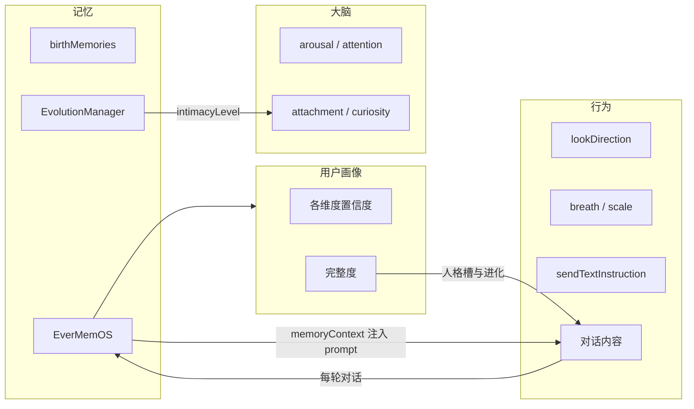
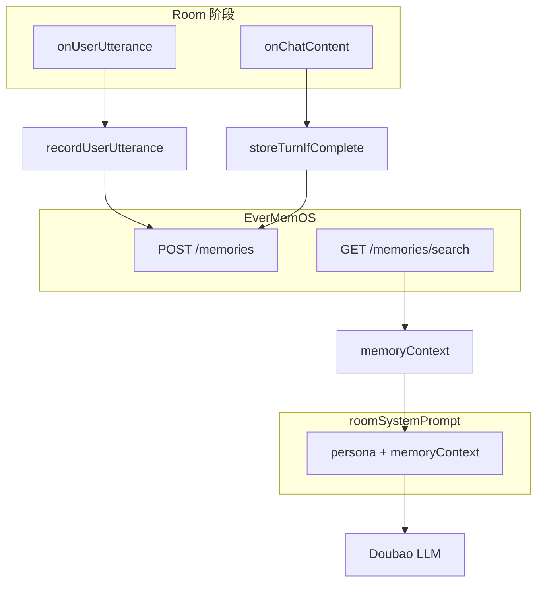
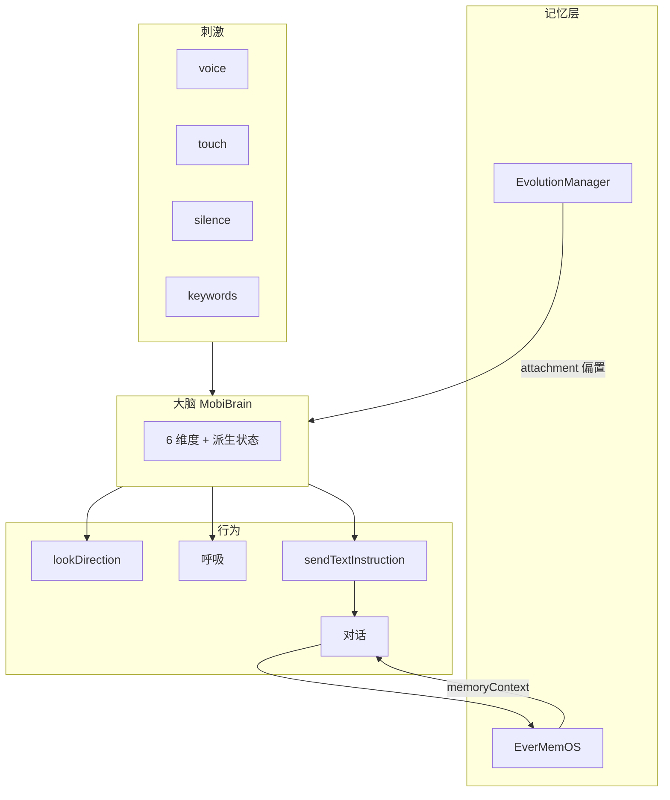

# Mobi 记忆、大脑与行为关系

**文档用途：** 阐明 Mobi 的**记忆**、**大脑（MobiBrain）**与**行为**三者之间的数据流与因果关系。作为理解 Mobi 智能层级与 EverMemOS 集成设计的参考。

**维护：** 2025-02，随 EverMemOS 集成与 MobiBrain 实现更新。

---

## 1. 三要素概览

| 要素 | 定义 | 实现状态 |
|------|------|----------|
| **记忆** | 持久化的信息：用户偏好、对话历史、关键时刻 | 部分实现：birthMemories、EvolutionManager、EverMemOS（Room 跨会话）|
| **用户画像** | 后台以 EverMemOS 为核心建立的用户人格画像（各维度估计+置信度）；SoulProfile 为 Anima 部分；含用户倾诉、语言习惯模仿；驱动人格槽与进化阶段；只进不退 | 待实现：见 [Mobi用户画像与进化驱动设计](Mobi用户画像与进化驱动设计.md)；进度与 MVP-Phase-Plan §7 对齐 |
| **大脑** | 内部状态（ arousal、attention、attachment 等）及 decay、习惯化 | 已实现：MobiBrain（MobiBrainState + MobiBrain），Room 注入 voice/touch/silence，输出 lookDirection、呼吸、seeking、startled |
| **行为** | 对外可观测输出：视觉（lookDirection、呼吸、scale）、对话（sendTextInstruction）、音效 | 已实现：ProceduralMobiView、Doubao、triggerProactiveConversation |

---

## 2. 核心关系：记忆 ↔ 大脑 ↔ 行为

### 2.1 记忆 → 画像 → 人格槽与进化

| 来源 | 作用 | 说明 |
|----------|------|------|
| **Anima + Room 对话与行为** | 写入 EverMemOS，供**用户画像服务**消费 | 画像服务以 EverMemOS 为技术核心的上游，输出各维度估计与置信度 |
| **用户画像完整度** | 驱动**人格槽**数值与**进化阶段**（幼年→青年→成年）| 人格槽 = 画像完整度的呈现；进化只进不退；详见 [Mobi用户画像与进化驱动设计](Mobi用户画像与进化驱动设计.md) |
| **画像置信度衰减** | Mobi 在行为上「意识到」 | 话术与反应更谨慎、试探（如「好久没见」），**阶段不退化** |

### 2.2 记忆 / 画像 → 大脑

| 来源 | 作用 | 说明 |
|----------|------|------|
| **EvolutionManager** | attachment 初始偏置（过渡期可保留）| 画像驱动后，attachment 初值亦可从画像维度推导 |
| **EverMemOS** | 间接通过 LLM | memoryContext 注入 roomSystemPrompt，LLM 输出受「你记得…」影响 |
| **birthMemories** | 按设计**不**注入 | 遵守 Anima 遗忘；若作画像种子可间接影响 persona |
| **画像置信度** | 衰减时影响 persona / 话术 | 注入「拿不准你」类上下文，Mobi 行为反映不确定感 |

### 2.3 大脑 → 行为

| 脑状态 / 维度 | 行为输出 | 当前实现 |
|---------------|----------|----------|
| **attention** | lookDirection | 暂为 dragStretch，未接大脑 |
| **arousal** | 呼吸快慢、scale | 部分：activityState 驱动口型 |
| **seeking** | sendTextInstruction（主动说话）| triggerProactiveConversation（15s 计时，未接大脑）|
| **comfort / startled** | 戳击音效、squash | 已有效果，未接大脑调制 |

详见 [Mobi阶段大脑与意识驱动设计.md](Mobi阶段大脑与意识驱动设计.md#4-大脑--行为输出输出映射)。

### 2.4 行为 → 记忆

| 行为 | 记忆写入 | 实现 |
|------|----------|------|
| **用户说话（onUserUtterance）** | EverMemOS 存储 | recordUserUtterance + storeTurnIfComplete |
| **AI 回复（onChatContent）** | EverMemOS 存储 | storeTurnIfComplete（user+assistant 成对）|
| **戳击 / 关键词** | EvolutionManager | scanAndRecordKeywords（如「咖啡」）|
| **每轮对话** | EvolutionManager | recordRoomInteraction → interactionCount |

---

## 3. EverMemOS 在关系中的位置

- **存储**：每轮对话结束（user 说完 + assistant 回复完整）→ 两条消息写入 EverMemOS
- **检索**：Room onAppear 前 → 检索 top 8 → 格式化为「你记得：…」→ 注入 roomSystemPrompt
- **效果**：LLM 输出时「知道」过去的对话，表现为更连贯、可引用过去的回复

---

## 4. Mobi 成长阶段下的差异（幼年 / 青年 / 成年）

> 全量交互行为详见 [Mobi交互行为完整设计](Mobi交互行为完整设计.md)。进化由**用户画像完整度**驱动，三阶段同步、只进不退；详见 [Mobi用户画像与进化驱动设计](Mobi用户画像与进化驱动设计.md)。

| 成长阶段 | 记忆 / 画像 | 大脑 | 行为 |
|----------|-------------|------|------|
| **幼年期 (newborn)** | EverMemOS 存+检（条数少，topK 4）；画像开始积累；人格槽由画像驱动填充 | 无 MobiBrain，纯响应式 | 本能反应；可引用少量过去，话术简短体现没那么聪明 |
| **青年期 (进化后)** | 画像完整度达阈值 A；EverMemOS 存+检；memoryContext 注入；人格槽由画像驱动 | 可选：MobiBrain 初版 | 能引用「你记得…」；人格槽进化；置信度衰减时更谨慎，**阶段不退** |
| **成年期 (child/adult)** | 画像完整度达阈值 B；更丰富检索；身份叙事 | MobiBrain 完整；记忆/画像驱动 curiosity/attachment | 主动提及过去；置信度衰减时话术「拿不准你」，**阶段不退** |

---

## 5. 数据流总览（含记忆）

---

## 6. 小结

1. **记忆** 与**行为**写入 EverMemOS，供**用户画像**服务消费；画像（各维度置信度）驱动**人格槽**与**进化阶段**，人格槽即画像完整度的呈现。
2. **进化只进不退**；画像置信度衰减时，Mobi 在行为与话术上「意识到」（更谨慎、试探），阶段不退化。
3. **大脑** 将刺激与记忆/画像综合为内部状态，驱动视觉、对话与音效；MobiBrain 未实现时，行为由 activityState、evolution 等直接驱动。
4. **幼年/青年/成年** 三成长阶段由画像完整度触发，详见 [Mobi用户画像与进化驱动设计](Mobi用户画像与进化驱动设计.md)、[Mobi交互行为完整设计](Mobi交互行为完整设计.md)。

---

## 相关文档

| 文档 | 路径 |
|------|------|
| Mobi 用户画像与进化驱动设计 | docs/Mobi用户画像与进化驱动设计.md |
| Mobi 交互行为完整设计 | docs/Mobi交互行为完整设计.md |
| Mobi 阶段大脑设计 | docs/Mobi阶段大脑与意识驱动设计.md |

---

*文档版本：2025-02，随 EverMemOS 集成创建。*
