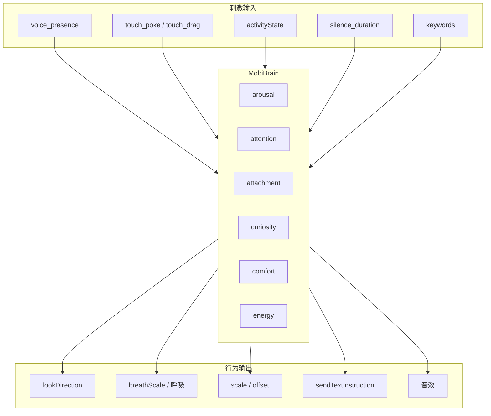

# Mobi 阶段大脑与意识驱动设计

**文档用途：** 为 Room 阶段的 Mobi 设计一套「像真实小动物」的由大脑驱动的意识与交互逻辑。适用对象为 **Mobi 出生后的 First Room**（Phase III）。

> **与成长阶段关系**：幼年期可简化/无 MobiBrain；青年期启用初版；成年期启用完整版。详见 [Mobi交互行为完整设计](Mobi交互行为完整设计.md)。

---

## 1. 设计目标

| 目标 | 说明 |
|------|------|
| **有内在生命感** | Mobi 不是纯响应式 UI，而是有内部状态、会随时间演化的存在 |
| **小动物心智** | 借鉴真实小动物：警觉、好奇、依恋、困倦、无聊、舒适 |
| **刺激 → 内在状态 → 行为** | 输入（声音、触摸、沉默）驱动脑状态，脑状态驱动视觉与对话行为 |
| **可预测但不机械** | 有规则可循，但有随机扰动和习惯化，避免「脚本感」 |

---

## 2. 大脑状态模型（MobiBrainState）

### 2.1 核心维度（0.0–1.0，带 decay）

| 维度 | 含义 | 类比 | 驱动与衰减 |
|------|------|------|------------|
| **arousal** | 唤醒度 | 困→清醒→兴奋 | 声音/触摸 ↑；沉默/无刺激 → 缓慢衰减 |
| **attention** | 注意力/朝向 | 盯着什么 | 声音源、触摸点、最近刺激方向 |
| **attachment** | 依恋度 | 对用户的亲近感 | 互动频率、触摸、正面回应 ↑ |
| **curiosity** | 好奇心 | 对新异的兴趣 | 新声音、新话题 ↑；重复刺激 → 习惯化 ↓ |
| **comfort** | 舒适度 | 安全感 | 温和触摸 ↑；突然大音量/戳击 ↓ |
| **energy** | 能量水平 | 累不累 | 长时间互动 ↓；沉默恢复 ↑ |

### 2.2 派生状态（从核心维度推导）

| 派生状态 | 条件 | 行为倾向 |
|----------|------|----------|
| **alert** | arousal > 0.6, attention 有目标 | 眼睛追踪、呼吸略快、身体微微紧绷 |
| **drowsy** | arousal < 0.3, energy < 0.4 | 眼睛半闭、呼吸慢、轻微漂移 |
| **curious** | curiosity > 0.5, comfort > 0.4 | 主动朝向声源、想说话 |
| **seeking** | arousal 中、长时间无互动 | 飘动、主动发声、吸引注意 |
| **bonded** | attachment > 0.7 | 更易被唤醒、戳击时更开心 |
| **startled** | 突然大音量 / 用力戳 | 短暂收缩、眼睛睁大、0.5s 后恢复 |
| **content** | comfort > 0.6, 低 arousal |  relaxed、呼吸平稳、微幅摇摆 |

---

## 3. 刺激 → 大脑更新（输入映射）

### 3.1 刺激类型

| 刺激 | 来源 | 强度/特征 |
|------|------|-----------|
| **voice_presence** | AudioVisualizerService.normalizedPower | 0–1，用户说话音量 |
| **voice_direction** | 暂缺，可先用屏幕中心为「用户方向」 | 后续可接设备朝向 |
| **touch_poke** | ProceduralMobiView onTapGesture | 戳击 |
| **touch_drag** | DragGesture (mobiPosition + mobiLiveTranslation) | 位移、力度（速度） |
| **touch_duration** | 触摸持续时间 | 轻触 vs 长按 |
| **ai_speaking** | activityState == .speaking | Mobi 自己在说 |
| **ai_listening** | activityState == .listening | 在听用户 |
| **silence_duration** | 距上次 voice/touch 的秒数 | 无聊度 |
| **conversation_turn** | 每轮对话 | 新鲜度、话题切换 |
| **keywords** | 用户话中的词（如「累」「咖啡」） | 语义信号 |

### 3.2 刺激 → 维度更新规则

| 刺激 | arousal | attention | attachment | curiosity | comfort | energy |
|------|---------|-----------|------------|-----------|---------|--------|
| voice_presence 高 | +0.15 | 朝向用户 | +0.02 | +0.1 | — | −0.01 |
| touch_poke 轻 | +0.1 |  tap 方向 | +0.05 | +0.05 | −0.02 | — |
| touch_poke 重 | +0.2 |  tap 方向 | — | — | −0.1 | — |
| touch_drag 持续 | +0.05 | 拖拽方向 | +0.03 | — | +0.02 | −0.005 |
| ai_speaking | +0.05 | — | — | — | — | −0.02 |
| silence 5–15s | −0.02/s | 漂移 | — | +0.03/s | — | +0.01/s |
| silence > 15s | −0.03/s | seeking | — | +0.05/s | — | +0.02/s |
| 新话题/新词 | — | — | — | +0.2 | — | — |
| 重复词（习惯化） | — | — | — | −0.1 | — | — |
| 关键词「累」 | −0.1 | — | +0.05 | — | +0.05 | −0.2 |
| 关键词「咖啡」 | +0.1 | — | — | +0.15 | — | +0.1 |

*数值为每事件/每秒的大致增量，需乘以 `deltaTime` 或事件权重；所有维度有独立的 decay 率（如 0.98^t）。*

---

## 4. 大脑 → 行为输出（输出映射）

### 4.1 视觉行为

| 脑状态 / 维度 | 输出 | 实现建议 |
|---------------|------|----------|
| **attention** | lookDirection | 眼睛朝向：优先 voice 方向 → touch 方向 → 随机微漂移 |
| **arousal 高** | 呼吸略快、scale 微增 | breathPhase *= 1.3；scaleEffect(1.02) |
| **arousal 低** | 呼吸慢、轻微下沉 | breathPhase *= 0.7；offsetY += 2 |
| **startled** | 短暂 squash 0.9 | pokeScale → 0.85，0.3s 恢复 |
| **drowsy** | 眼睛半闭感 | 可选：eyeScale * 0.8 或 sleepy 眼型增强 |
| **seeking** | 缓慢漂移、脉动 | mobiPosition 微幅 sin 漂移；脉冲环 |
| **content** | 柔和呼吸、微摆 | 呼吸 + 水平 1–2px 正弦漂移 |

### 4.2 对话行为（sendTextInstruction）

| 条件 | 触发 | 指令内容示例 |
|------|------|--------------|
| **seeking**（沉默 > 12s） | 一次/session | "The user hasn't said anything. Say something short to get their attention — a greeting or a gentle question." |
| **curious 高 + 新话题** | 不直接发指令 | 依赖 LLM 自然好奇，persona 已包含 |
| **drowsy + 被唤醒** | voice 打断 silence | 可选：注入 "You were drifting. The user's voice woke you. Respond with a gentle, slightly disoriented acknowledgment." |
| **bonded + 戳击** | touch_poke | 可选：不额外指令，依靠 persona 自然回应 |

*与现有 `triggerProactiveConversation` 统一：由「大脑 seeking 状态」驱动，而不是裸的 15s 计时。*

### 4.3 音效与触觉

| 条件 | 输出 |
|------|------|
| touch_poke + comfort 高 | squeak_1（现有）|
| touch_poke + comfort 低 / startled | 可选：更轻、更「惊讶」音效 |
| seeking 触发主动说话 | 无额外音效，保持自然 |

---

## 5. 眼睛与注意力系统（细化）

**现状**：`lookDirection = mobiPosition + mobiLiveTranslation`，即眼睛跟随拖拽。

**目标**：眼睛由「注意力」驱动，体现「在听谁 / 在看哪」。

### 5.1 注意力目标优先级

1. **用户说话时**：眼睛朝向「用户方向」（可简化为屏幕中下方或固定偏下）
2. **拖拽中**：眼睛朝向拖拽位移方向（维持现有）
3. **Mobi 说话时**：眼睛可略微收束或保持上一帧
4. **沉默 / seeking**：缓慢随机漂移，模拟「在找什么」

### 5.2 实现示意

```text
if activityState == .listening && audioPower > 0.1:
    lookTarget = userDirection  // 例如 CGSize(0, 30) 表示偏下
else if dragStretch != .zero:
    lookTarget = dragStretch
else if seeking:
    lookTarget = randomDrift(amplitude: 10)
else:
    lookTarget = previousTarget * 0.95  // 缓慢回中
lookDirection = lerp(lookDirection, lookTarget, 0.15)
```

---

## 6. 习惯化与记忆（简化）

| 机制 | 说明 |
|------|------|
| **习惯化** | 同一类刺激在短时间（如 60s）内重复出现，curiosity 增量衰减 |
| **会话记忆** | 本轮对话的关键词集合；新词 +curiosity，重复词 −curiosity |
| **跨会话** | 使用 EvolutionManager 的 interactionCount、intimacyLevel 作为 attachment 的初始偏置 |

---

## 7. 与现有组件对接

| 现有组件 | 对接方式 |
|----------|----------|
| **ProceduralMobiView** | 新增/接入 `MobiBrain`：传入 lookDirection、breathScale 修正、pokeScale 修正（startled）|
| **RoomContainerView** | 持有 `MobiBrain`，向其中注入 voice、touch、activityState、silence |
| **EvolutionManager** | attachment 初始值可从 intimacyLevel/100 推导 |
| **DoubaoRealtimeService** | seeking 时由 MobiBrain 决策是否 sendTextInstruction |
| **MobiVisualDNA** | movementResponse / bounciness 可调制 spring 参数，与 arousal 结合 |

---

## 8. 数据流总览



---

## 9. 实现分阶建议

| 阶段 | 内容 | 工作量 |
|------|------|--------|
| **P0** | MobiBrain 核心：6 维度 + decay；刺激 → 维度更新 | 中 |
| **P1** | attention → lookDirection 替换纯 drag；seeking → sendTextInstruction | 小 |
| **P2** | arousal/comfort → 呼吸、scale、startled 视觉 | 小 |
| **P3** | 习惯化、会话关键词记忆 | 中 |
| **P4** | 与 DNA（bounciness 等）结合调制动画 | 小 |

---

## 10. 设计原则小结

1. **刺激 → 脑 → 行为**：所有可见行为都经由内部状态，不直接「刺激 → 行为」。
2. **衰减与习惯化**：状态会随时间变化，重复刺激效果递减。
3. **小动物感**：警觉、好奇、依恋、困倦、寻求关注，符合小动物的心智模型。
4. **与现有人设一致**：Room persona 已定义「温暖、好奇、像伴侶」，大脑输出与之协调，不冲突。
5. **按成长阶段启用**：幼年期可不启用；青年期初版；成年期完整。见 [Mobi交互行为完整设计](Mobi交互行为完整设计.md)。

---

## 相关文档

| 文档 | 路径 |
|------|------|
| Mobi 交互行为完整设计 | docs/Mobi交互行为完整设计.md |
| Mobi 记忆-大脑-行为关系 | docs/Mobi记忆-大脑-行为关系.md |

---

*文档创建：2025-02，供 Phase III Mobi 阶段实现参考。*
