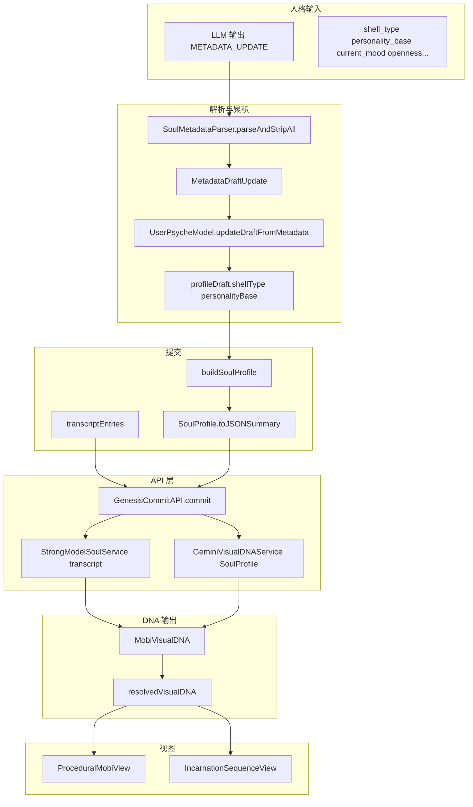

# Phase III: 用户人格 → Mobi 外形 链路审计报告

**目的**：确认从用户人格输入到 Mobi 视觉呈现的整条数据流是否完整，并标注缺口。

---

## 1. 链路总览

---

## 2. 分环链路检查

### 2.1 人格采集 ✅ 完整

| 环节 | 文件 | 状态 |
|------|------|------|
| LLM 输出 METADATA_UPDATE | MobiPrompts, SoulHookController | ✅ 格式含 shell_type, personality_base |
| 解析 | SoulMetadataParser.parseAndStripAll | ✅ 解析 shell_type, personality_base |
| 写入 draft | UserPsycheModel.updateDraftFromMetadata | ✅ 写入 profileDraft |
| 构建 SoulProfile | buildSoulProfile | ✅ draftShellType, draftPersonalityBase 入 SoulProfile |
| toJSONSummary | SoulProfile | ✅ 含 draftShellType, draftPersonalityBase |

### 2.2 transcript 收集 ✅ 完整

| 环节 | 文件 | 状态 |
|------|------|------|
| 用户话 | processUserInputFromASR | ✅ transcriptEntries.append(user) |
| AI 话 | processLLMResponse | ✅ transcriptEntries.append(assistant) |
| 构建 JSON | buildTranscriptJSON | ✅ 供强模型使用 |

### 2.3 API 分支 ✅ 逻辑正确

| 分支 | 条件 | 使用 | 人格来源 |
|------|------|------|----------|
| 强模型 | transcript 非空 | StrongModelSoulService | transcript 中隐含（LLM 推断） |
| Fallback | transcript 为空 | GeminiVisualDNAService | SoulProfile.toJSONSummary() |

### 2.4 DNA 生成 ⚠️ 缺口

| 服务 | 输入 | 输出 | 缺口 |
|------|------|------|------|
| StrongModelSoulService | transcript | visual_dna | Prompt 仅 eye_shape 3 种，**无 ear_type, body_form** |
| GeminiVisualDNAService | SoulProfile JSON | MobiVisualDNA | Prompt **无 ear_type, body_form**；有 shell_type→material 映射 |

### 2.5 MobiVisualDNA 结构 ⚠️ 缺口

| 字段 | 当前 | 设计（PhaseIII 文档） |
|------|------|----------------------|
| eye_shape | ✅ 有 | 需支持 16 种 |
| ear_type | ❌ 无 | 需新增 |
| body_form | ❌ 无 | 需新增 |
| material_id, palette_id | ✅ 有 | - |
| 其他 | ✅ 有 | - |

### 2.6 DNA 传递 ✅ 完整

| 环节 | 文件 | 状态 |
|------|------|------|
| API → ViewModel | GenesisViewModel.resolvedVisualDNA | ✅ |
| ViewModel → Engine | engine.setResolvedVisualDNA | ✅ |
| Engine → Room | RoomContainerView dna: engine.resolvedVisualDNA | ✅ |
| Engine → Incarnation | IncarnationViewModel(visualDNA:) | ✅ |

### 2.7 视图渲染 ⚠️ 缺口

| 资产 | ProceduralMobiView | 缺口 |
|------|---------------------|------|
| eye_shape | 仅 round/droopy/line | 缺少 sharp/gentle/sleepy 等 16 种 |
| ear_type | 未实现 | 需 EarOverlayView |
| body_form | 仅 RoundedRectangle | 需 16 种 body Form |
| personality_slot | 未实现 | 需 PersonalitySlotView |

---

## 3. 缺口汇总

| 序号 | 缺口 | 位置 | 优先级 |
|------|------|------|--------|
| 1 | MobiVisualDNA 无 earType, bodyForm | MobiVisualDNA.swift | 高 |
| 2 | StrongModelSoulService Prompt 无 ear_type, body_form；eye_shape 仅 3 种 | StrongModelSoulService.swift | 高 |
| 3 | GeminiVisualDNAService Prompt 无 ear_type, body_form | GeminiVisualDNAService.swift | 高 |
| 4 | ProceduralMobiView 眼型仅 3 种 | ProceduralMobiView.swift | 高 |
| 5 | ProceduralMobiView 无耳朵 | ProceduralMobiView.swift | 高 |
| 6 | ProceduralMobiView 无 body_form 变体 | MobiBodyMaterialView | 高 |
| 7 | 人格槽未实现 | 新组件 | 中 |

---

## 4. 补全顺序建议

1. **MobiVisualDNA**：新增 earType、bodyForm，默认值 "round"、"none"。
2. **StrongModelSoulService / GeminiVisualDNAService**：Prompt 补充 ear_type、body_form、16 种 eye_shape 及映射规则。
3. **ProceduralMobiView**：EyeView 16 种；EarOverlayView；bodyForm 切换。
4. **人格槽**：PersonalitySlotManager + PersonalitySlotView，与 EvolutionManager 联动。

---

## 5. 已完整环节

- 人格采集：METADATA_UPDATE → profileDraft → SoulProfile ✅
- transcript 收集：user + assistant 入 transcriptEntries ✅
- API 分支：transcript 优先 → 强模型；否则 SoulProfile → Gemini ✅
- DNA 传递：API → ViewModel → Engine → Room/Incarnation ✅
- 当前已有资产：eye_shape(3)、material、palette、blush、fuzziness、physics ✅

---

*审计完成。人格到 Mobi 外形的**主链路**完整，**扩展资产**（耳型、形状、16 种眼型、人格槽）需按上表补全。*
