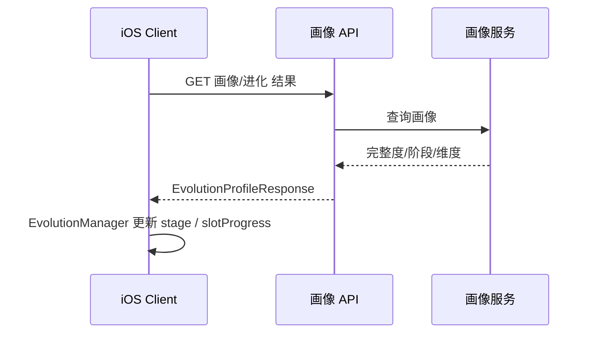

# 画像 ↔ 进化/人格槽 接口契约

**用途：** 客户端（EvolutionManager、人格槽 UI）与画像服务之间的 API 与数据结构约定。进化模块可按此契约对接 Mock 或真实画像；画像服务实现时按此契约输出。

**维护：** 与 [Mobi用户画像与进化驱动设计](Mobi用户画像与进化驱动设计.md)、[MVP-Phase-Plan](MVP-Phase-Plan.md)、[Mobi全栈白皮书](Mobi全栈白皮书.md) 同步。

---

## 1. 接口概览

- **职责**：客户端在 Room 阶段需要「当前用户的进化阶段 + 人格槽填充数据」，用于只进不退的阶段展示、人格槽 7 格展示、以及 EvolutionManager 的判定来源。
- **数据来源**：画像服务（上游消费 EverMemOS，输出完整度与阶段）；未就绪时客户端可使用 Mock 或本地 fallback（见 §5）。



---

## 2. 请求

### 2.1 端点建议

| 方法 | 路径 | 说明 |
|------|------|------|
| GET | `/profile/evolution` 或 `/user/{userId}/evolution` | 获取当前用户的进化与人格槽数据 |

具体路径由后端实现决定；客户端只需约定「单次 GET 返回 EvolutionProfileResponse」。

### 2.2 请求参数

- **身份**：由后端从会话/Token 解析 `userId`，或客户端传 `userId`（若已有）。
- **可选**：`lastStage`、`clientVersion` 等，用于兼容与灰度；首版可省略。

---

## 3. 响应体：EvolutionProfileResponse

### 3.1 字段定义

| 字段 | 类型 | 必填 | 说明 |
|------|------|------|------|
| `lifeStage` | string | 是 | 进化阶段：`newborn` \| `child` \| `adult`。只进不退，由服务端保证不回退。 |
| `slotProgress` | number | 是 | 人格槽（灵器）整体进度 0.0–1.0，驱动灵器瓶身填充；与 [ProceduralMobiView](Mobi/Features/Room/Views/ProceduralMobiView.swift) 的 `personalitySlotProgress` 对应，供 Soul Vessel 的 fillProgress 使用。 |
| `completeness` | number | 否 | 画像完整度 0.0–1.0，与阈值 A/B 对应；可用于调试或 UI 展示。 |
| `dimensionConfidences` | object | 否 | 各维度置信度 0.0–1.0。键建议与 Big Five 对齐：`openness`, `conscientiousness`, `extraversion`, `agreeableness`, `emotionalStability`。若提供，客户端可做高级展示或与灵器/完整度联动。 |
| `confidenceDecay` | boolean | 否 | 是否处于「置信度衰减」状态（如长期未互动）。为 true 时客户端/对话可触发「拿不准你」类话术与行为，阶段不变。 |
| `unlockedFeatures` | string[] | 否 | 已解锁的进化外观等，如 `["colorShift","coffeeCup"]`。若服务端不维护，由客户端按 `lifeStage` 与本地规则推导。 |
| `vessel_fill` | number | 否 | Soul Vessel 填充度 0.0–1.0；未提供时客户端可用 `slotProgress`/`completeness` 推导。见 [SoulVessel设计规范](SoulVessel设计规范.md)。 |
| `vessel_shape_type` | string | 否 | 灵器瓶身形状：`diamond`/`heart`/`star` 等，由性格推导；未提供时可用默认圆形。 |
| `language_habits` | string | 否 | 用户语言习惯描述，供 Room 对话注入；见 [语言习惯管道-画像侧](语言习惯管道-画像侧.md)。 |

### 3.2 与现有客户端对应关系

| 响应字段 | 客户端使用处 |
|----------|----------------|
| `lifeStage` | [EvolutionManager](Mobi/Services/Data/EvolutionManager.swift) `currentStage` / [MobiEnums.LifeStage](Mobi/Core/MobiEnums.swift)（需新增 `adult` 枚举值） |
| `slotProgress` | [RoomContainerView](Mobi/Features/Room/Views/RoomContainerView.swift) → `ProceduralMobiView` → 灵器（Soul Vessel）瓶身 fillProgress；画像返回值或本地降级 |
| `unlockedFeatures` | EvolutionManager.hasUnlocked(MobiFeature)，可与现有 [MobiFeature](Mobi/Services/Data/EvolutionManager.swift) 对齐 |
| `confidenceDecay` | 行为模块 / Room 阶段对话逻辑：控制「拿不准你」等表现 |
| `vessel_fill` / `vessel_shape_type` | Soul Vessel 胸前挂坠：填充度、瓶身形状；长按展示 Soul Sync Rate；见 [SoulVessel设计规范](SoulVessel设计规范.md) |
| `language_habits` | EvolutionManager.languageHabits → DoubaoRealtimeService.prepareForRoom(languageHabits:)；nil 则不注入 |

---

## 4. EvolutionManager 对接要点

- **读**：从画像 API 或本地缓存读取 `lifeStage`、`slotProgress`、可选 `unlockedFeatures`、`confidenceDecay`。
- **阶段话术**：客户端用 `lifeStage`（effectiveStage）与铭印数计算 `useNewbornGibberish = (effectiveStage==.newborn && 铭印数<3)`，传入 `prepareForRoom`；Room 对话与 seeking 按 newborn 乱码语/简单中文、child 小孩话、adult 伙伴话注入，见 [Mobi交互行为完整设计](Mobi交互行为完整设计.md)。
- **只进不退**：服务端保证 `lifeStage` 不回退；客户端若做本地持久化，应以服务端返回为准，且仅当服务端返回阶段 ≥ 本地阶段时更新，否则保留本地阶段。
- **人格槽（灵器）**：`slotProgress` 直接驱动灵器瓶身填充（人格槽进度），0–1；灵器为唯一可视化，长按展示 Soul Sync Rate。
- **Soul Vessel（MVP）**：画像 API 未返回 `vessel_fill` 时，客户端用 `slotProgress` 或 `completeness` 推导；`vessel_shape_type` 可由 DNA/personality_base 映射（理性→diamond、感性→heart、混乱→star）。详见 [SoulVessel设计规范](SoulVessel设计规范.md) §5。
- **初值/Mock**：未拉取到画像时，可回退到现有逻辑（如 interactionCount / 10 → slotProgress，本地 LifeStage.newborn/.child）。

---

## 5. Mock 约定（进化开发联调用）

在画像 API 未就绪前，客户端可依赖本地 Mock 数据实现对接，便于先完成 EvolutionManager 与 UI 的改造。

### 5.1 Mock 响应示例（JSON）

未接画像或失败时客户端返回的 Mock 使用 newborn，以便走幼年乱码语等流程：

```json
{
  "lifeStage": "newborn",
  "slotProgress": 0.2,
  "completeness": 0.25,
  "dimensionConfidences": {
    "openness": 0.6,
    "conscientiousness": 0.4,
    "extraversion": 0.5,
    "agreeableness": 0.7,
    "emotionalStability": 0.45
  },
  "confidenceDecay": false,
  "unlockedFeatures": []
}
```

### 5.2 Swift 模型建议（客户端）

```swift
struct EvolutionProfileResponse: Codable {
    let lifeStage: String           // "newborn" | "child" | "adult"
    let slotProgress: Double        // 0.0...1.0
    let completeness: Double?
    let dimensionConfidences: [String: Double]?
    let confidenceDecay: Bool?
    let unlockedFeatures: [String]?
}
```

将 `lifeStage` 字符串映射为 `LifeStage` 时，需在 [MobiEnums.swift](Mobi/Core/MobiEnums.swift) 的 `LifeStage` 中增加 `case adult`，并处理 `genesis`（仅 Anima/转场用，Room 内不出现）。

### 5.3 Mock 数据策略

- **策略 A**：客户端内嵌上述 JSON，在「未配置画像 baseURL」或「请求失败」时返回该 Mock，EvolutionManager 仅消费统一结构。
- **策略 B**：由后端提供 `/profile/evolution/mock` 或同一端点在 test 环境返回固定 Mock。

---

## 6. 错误与降级

- **超时/失败**：客户端使用上次成功缓存或本地 fallback（interactionCount 等），不阻塞 Room 进入。
- **字段缺失**：`slotProgress`、`lifeStage` 必填；若缺省则视为服务异常，走降级逻辑。

---

## 7. 相关文档

| 文档 | 路径 |
|------|------|
| Mobi 进化机制实现说明 | docs/Mobi进化机制实现说明.md |
| Mobi 用户画像与进化驱动设计 | docs/Mobi用户画像与进化驱动设计.md |
| SoulVessel 设计规范 | docs/SoulVessel设计规范.md |
| Fact 粒度注入设计 | docs/Fact粒度注入设计.md |
| MVP-Phase-Plan | docs/MVP-Phase-Plan.md |
| Mobi 全栈白皮书 | docs/Mobi全栈白皮书.md |
| 施工顺序表 | docs/施工顺序表.md |
