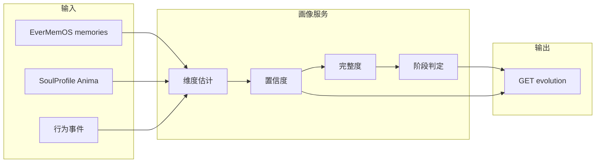

# 画像服务设计（后端实现要点）

**用途：** 画像服务作为 EverMemOS 上游，消费记忆与行为数据，输出各维度置信度、完整度、进化阶段与人格槽数据；供客户端按 [画像-进化接口契约](画像-进化接口契约.md) 拉取。本文档为后端实现或 spec 依据。

**维护：** 与 [Mobi用户画像与进化驱动设计](Mobi用户画像与进化驱动设计.md)、[画像-进化接口契约](画像-进化接口契约.md)、[MVP-Phase-Plan](MVP-Phase-Plan.md) 同步。

---

## 1. 定位与架构

- **角色**：用户人格画像的**上游计算层**，不替代 EverMemOS 的存储与检索；只读 EverMemOS（及后续行为流），写出「画像结果」供客户端或其它服务消费。
- **数据流**：
  - **输入**：EverMemOS 的 memories（Room 对话等）、Anima 阶段沉淀的 SoulProfile、可选行为事件（戳击/长按/沉默等，见 [行为上报与画像输入](行为上报与画像输入.md)）。
  - **输出**：按 [画像-进化接口契约](画像-进化接口契约.md) 的 `EvolutionProfileResponse`（lifeStage、slotProgress、completeness、dimensionConfidences、confidenceDecay、unlockedFeatures）；可选扩展 `language_habits` 供 Room 阶段对话注入，见 [语言习惯管道-画像侧](语言习惯管道-画像侧.md)；可选扩展 Soul Vessel 字段 `vessel_fill`、`vessel_shape_type`，MVP 不扩展时客户端用 slotProgress/completeness 推导，见 [SoulVessel设计规范](SoulVessel设计规范.md) §5；Fact 粒度注入（闲聊/偏好/深度暴露/纠正→+0%/+2%/+10%/+5%）见 [Fact粒度注入设计](Fact粒度注入设计.md)。
- **部署**：可与现有后端（如 StrongModelSoulService 所在服务）同进程或同栈；也可独立服务，通过内网读 EverMemOS、暴露 GET 画像/进化 接口。



---

## 2. 输入数据

### 2.1 EverMemOS

- **已有**：POST /api/v0/memories 写入单条消息（message_id, sender, content, role, create_time 等），认证 Bearer；GET /api/v0/memories/search 检索（query, user_id, memory_types, top_k 等），返回 episodic_memory 等。见 [EverMemOS Cloud API](https://docs.evermind.ai/api-reference)。
- **画像消费**：按 `user_id` 拉取该用户近期或全量记忆（条数可限，如 top_k=500）；从 `content` / `summary` 做文本分析，参与维度估计与置信度更新。可选：订阅写入事件做增量更新，或定时全量/增量批处理。

### 2.2 SoulProfile（Anima 部分）

- **来源**：Anima 结束时由 GenesisCommitAPI 提交的 SoulProfile（或 StrongModelSoulService 返回的 persona 中结构化部分）；需**沉淀到画像侧**，即 METADATA 逐轮累积后形成的 SoulProfile 写入画像服务或画像库，作为该用户画像的 **Anima 种子**。
- **沉淀时机**：Anima 第 15 轮结束、commit 成功后的回调或消息队列中，将 SoulProfile（含 warmth, energy, chaos, draftOpenness, draftCommunicationStyle, draftShellType, draftPersonalityBase 等）按 userId 写入画像存储。
- **用途**：作为 Room 之前已有的「人格信号」，与 Room 记忆一起参与五维估计；例如 warmth → 宜人性、energy → 外向性、chaos → 情绪稳定性（反向）、draftOpenness → 开放性。

### 2.3 行为事件（可选，序号 6 落地后）

- **内容**：戳击、长按、拖拽、沉默时长、谁先开口、触摸频率等；格式、通道与画像推断见 [行为上报与画像输入](行为上报与画像输入.md)。
- **通道**：MVP 推荐复用 EverMemOS 存储，sender=`mobi_behavior`，content 为 JSON（type=behavior, event=poke|drag|silence_interval|session_start|session_end 等）。
- **用途**：参与外向性/宜人性/亲密倾向等维度及置信度（行为稳定后置信度提升）；`last_activity_at` 可取最近一条 memory（含行为）时间。

---

## 3. 维度定义与置信度

- **维度集**：采用 Big Five 五维，与契约中 `dimensionConfidences` 键一致：`openness`, `conscientiousness`, `extraversion`, `agreeableness`, `emotionalStability`。每维一个**标量估计值**（0–1）+ **置信度**（0–1）。
- **SoulProfile / METADATA 映射**（首版可简化）：
  - openness ← draftOpenness, communication_style
  - extraversion ← energy, energy_tag
  - agreeableness ← warmth, intimacy_tag, communication_style
  - emotionalStability ← chaos, current_mood（反向）
  - conscientiousness ← 可从对话结构/话题推断，或先给固定初值
- **从记忆文本更新**：对每条 memory 的 content/summary 做轻量分析（关键词、情感、句长、话题等），更新对应维度的估计值与置信度。证据越多、越一致，置信度越高；长期无新证据则置信度衰减（见 §6）。
- **存储**：每用户一条「画像快照」或按时间序列存储各维度历史；读取时用最新快照 + 衰减计算（见下）。

---

## 4. 完整度聚合与阈值

- **完整度 completeness**：各维度置信度的聚合，0–1。建议公式之一：`completeness = mean(dimensionConfidences)` 或 `weighted_mean`；或「达到置信度 ≥ 0.4 的维度数 / 5」再归一化到 0–1。
- **阈值 A（幼年 → 青年）**：例如 completeness ≥ 0.35 或「至少 2 个维度置信度 ≥ 0.4」。具体数值可 A/B 或配置化。
- **阈值 B（青年 → 成年）**：例如 completeness ≥ 0.6 或「至少 4 个维度置信度 ≥ 0.5」。B > A。
- **人格槽 slotProgress**：与完整度一致或略做映射，例如 `slotProgress = completeness`，或 `min(1.0, completeness * 1.2)`，保证 0–1 供客户端灵器瓶身填充展示。

---

## 5. 进化阶段与只进不退

- **阶段枚举**：`newborn`（幼年）、`child`（青年）、`adult`（成年）。与客户端 [LifeStage](Mobi/Core/MobiEnums.swift) 对齐（需含 adult）。客户端据此注入阶段话术：newborn 铭印<3 乱码语学说话、否则简单中文，child 小孩话，adult 正常伙伴，见 [Mobi交互行为完整设计](Mobi交互行为完整设计.md)。
- **判定**：
  - 若 completeness ≥ B → lifeStage = adult
  - 否则若 completeness ≥ A → lifeStage = child
  - 否则 → lifeStage = newborn
- **只进不退**：服务端持久化「该用户历史上曾达到的最大阶段」maxStage。返回时 `lifeStage = max(maxStage, 本次判定结果)`，即只升不降；并将 maxStage 更新为当前 lifeStage 再落库。
- **unlockedFeatures**：可按 lifeStage 推导，例如 child → ["colorShift"], adult → ["colorShift","coffeeCup"]；若需更细粒度可由配置或规则维护。

---

## 6. 置信度衰减与 confidenceDecay

- **含义**：用户长期未产生新互动（无新记忆、无行为事件），则各维度置信度随时间衰减；但阶段不退化（已由 §5 保证）。
- **衰减规则（建议）**：设 `last_activity_at` 为该用户最近一条 memory 或行为事件的时间。若 `now - last_activity_at > T`（如 T = 7 天），则置 `confidenceDecay = true`；并可对「当前用于展示的置信度」做时间衰减（如每 7 天乘 0.95，下限 0.2），不写回永久存储，仅用于本次响应。
- **输出**：在 EvolutionProfileResponse 中返回 `confidenceDecay: true/false`，客户端 / **Room 阶段对话逻辑**据此触发「拿不准你」等话术与行为；lifeStage 仍按 maxStage 不变。

---

## 7. API 实现要点

- **端点**：实现 GET `/profile/evolution` 或 `/user/{userId}/evolution`；身份由会话/Token 解析 userId，或由请求体/Query 传 userId。
- **响应体**：严格按 [画像-进化接口契约](画像-进化接口契约.md) §3 的 `EvolutionProfileResponse` 返回：lifeStage, slotProgress, completeness（可选）, dimensionConfidences（可选）, confidenceDecay（可选）, unlockedFeatures（可选）。
- **性能**：可对画像结果做短时缓存（如 5 分钟/用户），避免每次请求都重算；写入新 memory 或 SoulProfile 时令该用户缓存失效。

---

## 8. 伪代码（核心流程）

```
function getEvolutionProfile(userId):
  soulProfile = loadSoulProfile(userId)           // Anima 沉淀
  memories = everMemOS.search(userId, top_k=300)
  behaviors = loadBehaviorEvents(userId)          // 可选

  dimensions = computeDimensions(soulProfile, memories, behaviors)
  confidences = dimensions.confidences
  completeness = mean(confidences)                // 或加权
  slotProgress = min(1.0, completeness)

  thresholdA = 0.35
  thresholdB = 0.6
  if completeness >= thresholdB: stage = "adult"
  else if completeness >= thresholdA: stage = "child"
  else: stage = "newborn"

  maxStage = loadMaxStage(userId)
  lifeStage = max(maxStage, stage)
  if stage > maxStage: persistMaxStage(userId, lifeStage)

  lastActivity = max(lastMemoryTime(memories), lastBehaviorTime(behaviors))
  confidenceDecay = (now - lastActivity) > 7_days
  if confidenceDecay: confidences = applyDecay(confidences, lastActivity)

  unlockedFeatures = deriveFromLifeStage(lifeStage)

  return { lifeStage, slotProgress, completeness, dimensionConfidences: confidences, confidenceDecay, unlockedFeatures }
```

---

## 9. 相关文档

| 文档 | 路径 |
|------|------|
| 画像-进化接口契约 | docs/画像-进化接口契约.md |
| Mobi 用户画像与进化驱动设计 | docs/Mobi用户画像与进化驱动设计.md |
| Mobi 全栈白皮书 | docs/Mobi全栈白皮书.md |
| 施工顺序表 | docs/施工顺序表.md |
