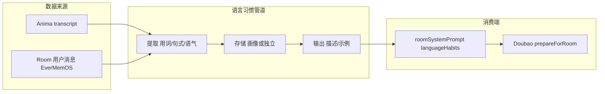

# 语言习惯管道（画像侧）

**用途：** 定义从用户对话中提取用词/句式/语气等**语言习惯**的数据流、存储与产出形式，以及如何供 **Room 阶段** 对话注入使用。与 [Mobi用户画像与进化驱动设计](Mobi用户画像与进化驱动设计.md) §6、[画像服务设计](画像服务设计.md) 及 Room 侧 roomSystemPrompt 注入端对齐。

**维护：** 与 [MobiPrompts](Mobi/Core/MobiPrompts.swift)（roomSystemPrompt 的 languageHabits 参数）、[DoubaoRealtimeService.prepareForRoom](Mobi/Services/Network/Doubao/DoubaoRealtimeService.swift) 同步。

---

## 1. 范围与边界

- **本管道**：画像侧（或独立语言分析模块）负责「从对话数据 → 提取 → 存储/输出语言习惯描述」。
- **注入端**：**Room 阶段** 的 system prompt（roomSystemPrompt）与 Doubao prepareForRoom；不包含 Anima 阶段的对话逻辑（Anima 有独立的 15 轮 Creation Ritual，见 [Anima阶段对话逻辑](Anima阶段对话逻辑.md)）。
- **数据来源**：既含 **Anima** 的 transcript（用户在 Anima 中的发言），也含 **Room** 的 onUserUtterance / 写入 EverMemOS 的用户消息；二者共同作为语言习惯的输入。

---

## 2. 数据流

- **提取**：从 Anima transcript 与 Room 用户消息中分析高频词、口头禅、句长、语气词、称呼/自称等（见 [Mobi用户画像与进化驱动设计](Mobi用户画像与进化驱动设计.md) §6.1）。
- **存储**：可与画像服务共用存储（画像扩展输出 `languageHabits` 块），或独立「用户语言习惯」表/字段；需按 user_id 关联。
- **输出**：结构化描述字符串（如「偏好短句、常用语气词啦呀、称呼搭档」），供 Room 侧注入；可选带示例句或置信度，按阶段调节是否注入及强度（幼年弱、青年/成年增强）。

---

## 3. 与 Room 注入端的接口

- **Room 侧入口**：[MobiPrompts.roomSystemPrompt(personaJSON:memoryContext:confidenceDecay:stage:languageHabits:useNewbornGibberish:)](Mobi/Core/MobiPrompts.swift) 的 `languageHabits` 参数；当非空时追加到 system prompt，指导 Mobi 适度模仿用户习惯。话术风格由 stage 与 useNewbornGibberish 控制（幼年乱码语学说话 / 简单中文、青年小孩话、成年伙伴话），见 [Mobi交互行为完整设计](Mobi交互行为完整设计.md)。
- **调用链**：Room 进入时 `prepareForRoom(personaJSON:memoryContext:confidenceDecay:stage:languageHabits:useNewbornGibberish:)`；`languageHabits` 由客户端从画像 API 或本地缓存读取；`stage`、`useNewbornGibberish`（newborn 且铭印数<3）由 EvolutionManager 与 ImprintService 计算。
- **契约**：画像侧（或语言分析模块）产出**单段自然语言描述**即可，例如：
  - `"用户偏好短句，常用「还行」「嗯」；称呼随意，可适度用「啦」「呀」回应。"`
  - Room 侧不做二次解析，整段写入 prompt；具体 prompt 文案见 MobiPrompts 内对 `languageHabits` 的拼接。

---

## 4. 与画像服务的关系

- **同源**：语言习惯与人格画像共用同一对话数据源（Anima transcript + Room 用户消息）；画像服务在计算维度时可一并产出语言习惯块，减少重复拉取。
- **扩展**：画像 API（或单独的语言习惯 API）可增加响应字段，例如 `language_habits: String?`；客户端在请求进化/画像时一并拿到，传入 prepareForRoom。
- **独立实现**：若暂不扩展画像 API，可由独立「语言习惯」服务消费 EverMemOS 用户消息，产出描述后写入缓存或单独接口，Room 侧按需拉取。

---

## 5. 按阶段调节

- **幼年期**：可少模仿或仅注入弱描述（如「用户有时用口语化表达」），保持 Mobi 本能口吻。
- **青年/成年期**：随画像完整度或语言习惯置信度提升，注入更具体的描述与示例，模仿强度递增。实现上可由客户端根据 evolution.stage 或画像返回的 confidence 决定是否传入 languageHabits 及截断长度。

---

## 6. 实现要点小结

- **画像侧**：从 Anima + Room 对话数据提取语言习惯 → 产出结构化描述字符串 → 通过画像 API 扩展字段或独立接口提供给客户端。
- **Room 侧**：已支持 languageHabits 参数；客户端在 prepareForRoom 时传入画像/语言习惯服务返回的字符串即可，无需改 prompt 结构。
- **当前状态**：画像服务尚未产出 `language_habits`，Room 固定传 `nil` 为**预期行为**；注入端已就绪，画像扩展后即可接入。
- **数据来源**：Anima transcript（GenesisCommitAPI 或 StrongModelSoulService 上游）、EverMemOS 中该用户的 Room 消息；与画像人格维度同源，可同管道处理。

---

## 7. 相关文档

| 文档 | 路径 |
|------|------|
| Mobi 用户画像与进化驱动设计 | docs/Mobi用户画像与进化驱动设计.md |
| 画像服务设计 | docs/画像服务设计.md |
| Anima 阶段对话逻辑 | docs/Anima阶段对话逻辑.md |
| 施工顺序表 | docs/施工顺序表.md |
